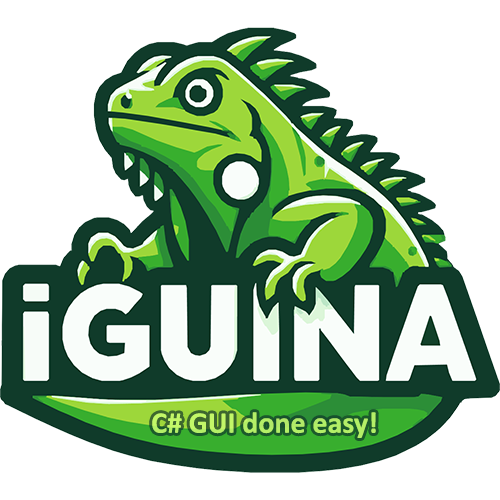

# Iguina

`Iguina` is a framework-agnostic, cross platform, modern UI system for C#.

Its a spiritual successor to the [GeonBit.UI](https://github.com/RonenNess/GeonBit.UI) library, but takes a more flexible and modern approach, and can be used with any framework, and not just `MonoGame`.

## Table Of Content

Understanding `Iguina` and quick examples:

* [Introduction](#introduction)
* [Demo Projects](#demo-projects)
* [Quick Examples](#quick-examples)
* [Basic Concepts](#iguina-basic-concepts)

Writing drivers and a UI theme (only required if you don't use the built-in drivers and UI theme from the demo projects):

* [Writing Drivers](#writing-drivers)
* [Writing Stylesheets](#writing-stylesheets)

Using `Iguina` in your application:

* [Iguina Setup](#iguina-setup)
* [The UI System](#iguina-ui-system)
* [UI Entities](#iguina-ui-entities)

Miscs:

* [License](#license)


# Introduction

## Key Features

`Iguina` provides the following key features:

* UI layout with constant / auto anchors, and relative sizing for responsiveness.
* All the basic UI elements for a game or an editor project:
    * Panels.
	* Buttons.
	* Sliders.
	* Progress Bars.
	* Scrollbars.
	* Paragraphs, Titles, and Labels.
	* Checkboxes.
	* Radio Buttons.
	* List Box.
	* Drop Down List.
	* Text Input.
    * Numeric Input.
	* Horizontal / Vertical Lines.
    * Message Boxes & file dialogs.
    * Color Slider and Color Picker.
* Extensive Stylesheet system to load an entire UI theme from files.
* Smooth transitions and animations.
* Cursor styles and handling.
* Events system to register to any UI event and respond accordingly.
* A free public domain UI theme that comes with the demo.

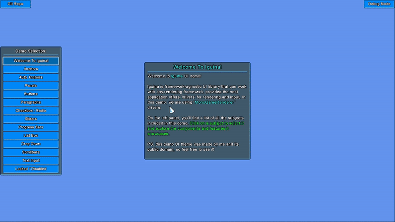

## GeonBit.UI vs Iguina

If you have a `MonoGame` project and you're already using [GeonBit.UI](https://github.com/RonenNess/GeonBit.UI), it will probably won't worth the effort to switch to `Iguina`. Also keep in mind that currently not all `GeonBit.UI` features are supported in `Iguina`.

However, you should pick `Iguina` over `GeonBit.UI` for the following cases:

- **For a new project.** `Iguina` is going to be maintained for longer, it has leaner and modern APIs, and its *not* dependant on `MonoGame` and its content manager.
- **For projects that are not in MonoGame.** `Iguina` is completely framework-agnostic and can be used with `RayLib`, `SFML`, `SDL` or any other alternative.
- **If you need any of the new features.** `Iguina` introduces some new features, including animations, cursor stylesheet, non-monospace fonts support, and much more.
- **For cross platform projects.** `Iguina` is built with a more flexible design and can be ported more easily to any framework or device.

## Integration

To make `Iguina` framework-agnostic, the host application need to provide 'drivers' layer to the UI system. There are two types of drivers to implement:

- **Renderer**: an object that implements basic 2D rendering.
- **Input Provider**: an object that provides basic mouse and keyboard input.

This is all `Iguina` needs to work. You can use whatever framework you want for rendering and whatever method you want for input, and just provide this functionality to `Iguina` via the drivers.

Note that for gamepad and other input methods that are not mouse / keyboard based, you can emulate mouse move and clicks and the UI would work normally. For example, gamepad sticks can emulate mouse movement, and triggers can emulate mouse clicks.

# Demo Projects

`Iguina` includes a generic demo project located in the `Iguina.Demo/` folder. This project takes drivers as input to create an example UI, without depending on specific rendering and input layers. There you can also find the built-in free UI theme (under Assets).

In addition to the generic demo project (which is a DLL), Iguina also provides two executable demo projects that uses it: one for `MonoGame` and another for `RayLib`.

You can take the `Renderer` and `Input Provider` implementations from these demos and use in your own projects, as they offer a solid starting point. Or you can implement your own, which is quite easy to do.

Note: if you take the demo projects implementations, know that rendering text outline is done in a lacky, quick and dirty way. 
You might want to replace that part with a proper shader (not mandatory).

# Quick Examples

Before we learn about `Iguina` and how to use it, lets see a quick example with `MonoGame` and `RayLib`.
Note: the corresponding drivers are not shown here. They can be found in the provided demo projects, along with many other `Iguina` examples. Check them out.

## MonoGame

```cs
/// <summary>
/// Basic monogame example.
/// </summary>
public class IguinaMonoGameExample : Game
{
    private GraphicsDeviceManager _graphics = null!;
    private SpriteBatch _spriteBatch = null!;
    UISystem _uiSystem = null!;

    public IguinaMonoGameExample()
    {
        _graphics = new GraphicsDeviceManager(this);
        Content.RootDirectory = "Content";
        IsMouseVisible = true;
        Window.Title = "Iguina Demo - MonoGame";
    }

    protected override void Initialize()
    {
        base.Initialize();
    }

    protected override void LoadContent()
    {
        _spriteBatch = new SpriteBatch(GraphicsDevice);

        // start demo project and provide our renderer and input provider.
        var uiThemeFolder = "../../../../Iguina.Demo/Assets/DefaultTheme";

        // create ui system
        var renderer = new MonoGameRenderer(Content, GraphicsDevice, _spriteBatch, uiThemeFolder);
        var input = new MonoGameInput();
        _uiSystem = new UISystem(Path.Combine(uiThemeFolder, "system_style.json"), renderer, input);

        // create panel with hello message
        {
            var panel = new Panel(_uiSystem);
            panel.Anchor = Defs.Anchor.Center;
            panel.Size.SetPixels(400, 400);
            _uiSystem.Root.AddChild(panel);

            var paragraph = new Paragraph(_uiSystem);
            paragraph.Text = "Hello World!";
            panel.AddChild(paragraph);
        }
    }

    protected override void Update(GameTime gameTime)
    {
        if (GamePad.GetState(PlayerIndex.One).Buttons.Back == ButtonState.Pressed || Keyboard.GetState().IsKeyDown(Keys.Escape))
            Exit();

        // update input and ui system
        var input = (_uiSystem.Input as MonoGameInput)!;
        input.StartFrame(gameTime);
        _uiSystem.Update((float)gameTime.ElapsedGameTime.TotalSeconds);
        input.EndFrame();

        base.Update(gameTime);
    }

    protected override void Draw(GameTime gameTime)
    {
        GraphicsDevice.Clear(Microsoft.Xna.Framework.Color.CornflowerBlue);
        
        // render ui
        var renderer = (_uiSystem.Renderer as MonoGameRenderer)!;
        renderer.StartFrame();
        _uiSystem.Draw();
        renderer.EndFrame();

        base.Draw(gameTime);
    }
}
```

Result should look like this (provided you got the `MonoGame` drivers from the demo project first):


## RayLib

```cs
// get screen resolution for demo size
int screenWidth = 800;
int screenHeight = 600;

// init window
Raylib.SetConfigFlags(ConfigFlags.Msaa4xHint | ConfigFlags.ResizableWindow);
InitWindow(screenWidth, screenHeight, "Iguina.Demo.RayLib");

// start demo project and provide our renderer and input provider.
var uiThemeFolder = "../../../../Iguina.Demo/Assets/DefaultTheme";
var renderer = new RayLibRenderer(uiThemeFolder);
var input = new RayLibInput();
var uiSystem = new Iguina.UISystem(Path.Combine(uiThemeFolder, "system_style.json"), renderer, input);

// create panel with hello message
{
    var panel = new Panel(uiSystem);
    panel.Anchor = Anchor.Center;
    panel.Size.SetPixels(400, 400);
    uiSystem.Root.AddChild(panel);

    var paragraph = new Paragraph(uiSystem);
    paragraph.Text = "Hello World!";
    panel.AddChild(paragraph);
}

// Main game loop
while (!WindowShouldClose())
{
    // begin drawing
    BeginDrawing();
    ClearBackground(Raylib_cs.Color.DarkBlue);

    // update and draw ui
    BeginMode2D(new Camera2D() { Zoom = 1f });
    renderer.StartFrame();
    uiSystem.Update(GetFrameTime());
    uiSystem.Draw();
    renderer.EndFrame();
    EndMode2D();

    // end drawing
    EndDrawing();
}

CloseWindow();
Environment.Exit(0);
```

Result should look like this (provided you got the `RayLib` drivers from the demo project first):

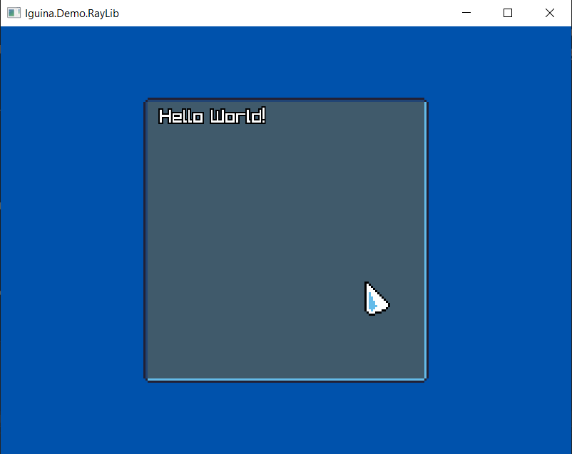

# Iguina Basic Concepts

Before we dive into code, lets go over some basic concepts of `Iguina`.

## UI System

`UISystem` is the main object that manage and runs an instance of UI. This include the UI style, all its entities, events, etc.
You can run multiple `UISystem`s at the same time, but usually that won't be necessary.

The `UISystem` contains a `Root` entity, which is the UI tree top element you can add entities to.

## Entities

Every UI element type is an `Entity`, and you can add any entity type as a child of another entity.

## Anchors

`Iguina` positions entities based on **Anchors**. An Anchor basically means to which side the entity should stick to inside its parent entity. 

We have the following constant anchors to position entities by:

- **TopLeft**: Will position entity top-left corner on the internal top-left corner of its parent entity region.
- **TopCenter**: Will position entity top-center point on the internal top-center position of its parent entity region.
- **TopRight**: Will position entity top-right corner on the internal top-right corner of its parent entity region.
- **BottomLeft**: Will position entity bottom-left corner on the internal bottom-left corner of its parent entity region.
- **BottomCenter**: Will position entity bottom-center point on the internal bottom-center position of its parent entity region.
- **BottomRight**: Will position entity bottom-right corner on the internal bottom-right corner of its parent entity region.
- **CenterLeft**: Will position entity center-left point on the internal center-left position of its parent entity region.
- **Center**: Will position entity center point on the center position of its parent entity region.
- **CenterRight**: Will position entity center-right point on the internal center-right position of its parent entity region.

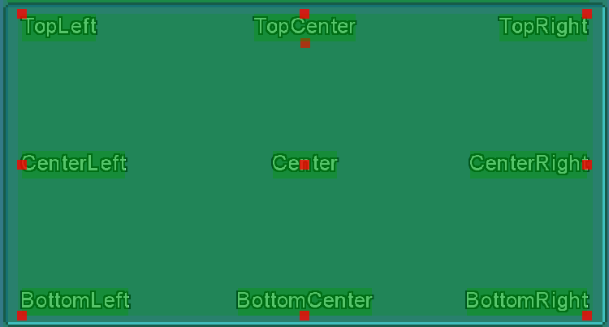

In addition, we have 'Auto Anchors', which will position entities automatically based on other entities in the parent:

- **AutoLTR**: Will position entities one under another, aligned left-to-right.
- **AutoInlineLTR**: Will position entities next to each other, aligned left-to-right.
- **AutoRTL**: Will position entities one under another, aligned right-to-left.
- **AutoInlineRTL**: Will position entities next to each other, aligned right-to-left.
- **AutoCenter**: will position entities one under another, aligned to center.

### Offset

Entities also have an offset from the anchor they are aligned to. 
For example, an offset of {x:10, y:0} and anchor of TopRight, means that the entity will stick to the parent top-right internal corner, and move 10 pixels to the left from that position.

Entities offset can be in pixels, or as percent of parent entity size.

## Sizing

Similar to offsets, entities size can be in pixels, or as percent of parent entity size.

Every entity type has its own default size, and in addition default sizes can be defined in the stylesheets, which we will cover next.

## Stylesheets

A stylesheet is an object that defines how to render, size, and position a UI entity. The stylesheets define the entire appearance of your UI system, and you can create them via code or load them from JSON files.

To learn more, you can check out the stylesheets of the [demo project UI Theme](Iguina.Demo/Assets/DefaultTheme/Styles/). We will cover stylesheets and explain how to write them in details later in this doc, in [this section](#writing-stylesheets).

## Entity States

Every UI Entity has a 'state' indicating its current interaction with the user. 
Stylesheets can define different graphics to use per state, and transition between states can be immediate, or smooth (animated).

Every entity can have the following states:

- **Default**: default entity state when its not interacted with.
- **Targeted**: the entity is currently being targeted by the user, ie mouse points on it.
- **Interacted**: the user is currently interacting with this entity. for example, in buttons, it means the user is pressing down on the entity.
- **Focused**: the entity is focused after being the last entity the user interacted with, and accepts keyboard interactions.
- **Checked**: for entities that have check state (buttons, checkbox, radio buttons), this is the state when the entity is checked.
- **TargetedChecked**: for entities that are currently checked *and* targeted by the user.
- **Disabled**: for entities that are currently disabled.
- **DisabledChecked**: for entities that are currently checked *and* disabled.

Note that you don't have to define graphics for every state. States will fallback to another states when properties are not defined, and eventually will go all the way back to Default.

The following list show the fallback order of states when properties are missing in stylesheet:

- **Default** will default to hard-coded default values.
- **Targeted** -> Default.
- **Interacted** -> Default.
- **Checked** -> Interacted -> Default.
- **TargetedChecked** -> Checked -> Interacted -> Default.
- **Disabled** -> Default.
- **DisabledChecked** -> Disabled -> Default.


# Writing Drivers

As mentioned before, to use `Iguina` your host application need to provide the UI system with *drivers*. 
There are two types of drivers to implement:

- **Iguina.Drivers.IRenderer**: object responsible to render the UI with whatever framework you use.
- **Iguina.Drivers.IInputProvider**: object responsible to provide user input to the UI system.

If you need a shelf implementation for `MonoGame` or `RayLib`, you can find them here:

- **MonoGame**: [Renderer](Iguina.Demo.MonoGame/MonoGameRenderer.cs) / [Input Provider](Iguina.Demo.MonoGame/MonoGameInput.cs).
- **RayLib**: [Renderer](Iguina.Demo.RayLib/RayLibRenderer.cs) / [Input Provider](Iguina.Demo.RayLib/RayLibInput.cs).

Just copy them into your project and you're good to go. For `MonoGame` be sure to copy content assets as well.

If you want to implement your own drivers or use a framework not covered here, continue reading.

## Renderer

The Renderer class (`Iguina.Drivers.IRenderer`) is responsible to render textures and texts, and is what gives `Iguina` the ability to present itself on screen. 

When implementing the `Renderer`, you need to implement the following methods:

### `Rectangle GetScreenBounds();`

Return a rectangle representing the visible region we can render on.
By default should return Rectangle(0, 0, WindowWidth, WindowHeight), but if you want the GUI to only cover a part of the screen and not all of it, you can provide offset or smaller width / height.

### `void DrawTexture(string? effectIdentifier, string textureId, Rectangle destRect, Rectangle sourceRect, Color color);`

Render a 2D texture on screen. This is one the main methods `Iguina` uses to render itself.

**Parameters**:

- **effectIdentifier**: The effect identifier to use, or null for plain rendering without any special effects. This property comes from the stylesheets. For example, in the demo project we have an effect called 'disabled' which we use for entities disabled state, that renders everything in greyscale.
- **textureId**: Texture id to render. This property comes from the stylesheets. It can be a full path, or just a name, up to you. The drivers are responsible to understand which texture to use from this id, and load it if needed to.
- **destRect**: The destination rectangle, in screen pixels, to draw the texture on.
- **sourceRect**: The source rectangle, in pixels, from the texture to draw.
- **color**: Tint color to draw the texture with. Final color should be `texelColor * color`.

### `Point MeasureText(string text, string? fontId, int fontSize, float spacing);`

Measure the actual size of a string, given font, size and spacing factor.

- **text**: String to measure.
- **fontId**: Which font to use, or null for default font. This property comes from the stylesheets. The drivers are responsible to understand which texture to use from this id, and load it if needed to.
- **fontSize**: Font size to measure.
- **spacing**: Spacing factor between characters.

### `int GetTextLineHeight(string? fontId, int fontSize);`

Measure the line height, in pixels, of a given font id and size.
In most cases, this can be implemented as something like this:

```
return MeasureText("A", fontId, fontSize, 0f).Y;
```

### `void DrawText(string? effectIdentifier, string text, string? fontId, int fontSize, Point position, Color fillColor, Color outlineColor, int outlineWidth, float spacing);`

Render 2D text on screen. This is one the main methods `Iguina` uses to render itself.

**Parameters**:

- **effectIdentifier**: The effect identifier to use, or null for plain rendering without any special effects. This property comes from the stylesheets. For example, in the demo project we have an effect called 'disabled' which we use for entities disabled state, that renders everything in greyscale.
- **text**: String to render.
- **fontId**: Which font to use, or null for default font. This property comes from the stylesheets. The drivers are responsible to understand which texture to use from this id, and load it if needed to.
- **fontSize**: Font size to render with.
- **position**: Top-left position to start rendering text from.
- **fillColor**: Text fill color.
- **outlineColor**: Text outline color. Note that alpha may be 0, in which case, you shouldn't render outline.
- **outlineWidth**: Text outline width. Note that it may be 0, in which case, you shouldn't render outline.
- **spacing**: characters spacing factor.

Note: in the default drivers implementation for both `RayLib` and `MonoGame`, outline is implemented in a quick-and-dirty way by simply rendering the string multiple times with offset for outline, and then on top of it render the fill without offset.
This is less efficient and doesn't look that good with opacity. It's recommended to replace this implementation with something that uses a shader to draw outline. But not mandatory, it will work either way.

### `void DrawRectangle(Rectangle rectangle, Color color);`

Render a colored rectangle on screen.
This method is mostly used for debug draw mode, and is not that critical to implement efficiently.

### `void SetScissorRegion(Rectangle region);`

Set a region on screen, in pixels, on which we can render pixels. Anything rendered outside this region, should not appear.
We use this method to implement hidden overflow mode for panels with scrollbars.

If you don't implement this method properly (ie leave it empty inside), everything would work pretty much the same, but entities that exceed parent panels will be visible instead of hidden.

### `Rectangle? GetScissorRegion();`

Get the currently set scissor region, or null if no limit is set.

### `void ClearScissorRegion();`

Clear previously set scissor region, allowing us to render on the entire visible screen.

### `Color GetPixelFromTexture(string textureId, Point sourcePosition);`

Return pixel color from a texture id and source offset in texture.
This method is used by color picker entities. If you don't use them, you can just return a constant value from this method.

### `Point? FindPixelOffsetInTexture(string textureId, Rectangle sourceRect, Color color, bool returnNearestColor)`

Return pixel offset from a texture id and source rectangle that matches the given color.
This method is used by color picker entities to set value from Color. If you don't need it, you can just return null from this method.

## Input Provider

The Input Provider class (`Iguina.Drivers.IInputProvider`) is responsible to pass user input to the UI system. This includes mouse, keyboard, and text typing input.

While the input provider interface is designed around mainly keyboard and mouse, you can implement it internally for any kind of input device. For example, you can emulate gamepad movement as mouse movement, to control the UI via gamepad.

When implementing the `Input Provider`, you need to implement the following methods:

### `Point GetMousePosition();`

Return mouse current position, in pixels, as offset from your window's top-left corner.

### `bool IsMouseButtonDown(MouseButton btn);`

Return if one of the mouse buttons is currently being pressed down.

### `int GetMouseWheelChange();`

Return if the mouse wheel was scrolled in this frame. 

- If the mouse wheel is being scrolled up, return -1.
- If the mouse wheel is being scrolled down, return 1.
- If the mouse wheel is not being scrolled, return 0.

### `int[] GetTextInput();`

Return the unicode values of all the characters that are being typed by the user during this update call.
This method is a bit tricky, as you also need to handle *repeat delay* and *repeating rate*.

- **Repeat Delay** is a delay to wait before starting to repeat a character while its keyboard key is held down.
- **Repeat Rate** is the rate to add more and more instances of a character while its key is being held down, after the initial repeat delay is over.

If you try to play with any text editor, you would notice these delays are not the same.
Without proper delay and rate limit, characters will be typed too fast.

Note: 

* This method does not handle commands such as line break, delete, etc. This is handled separately.
* This method should also handle capital case, for example if shift is being held down.

This method is perheps the most complicated thing to implement for `Iguina`.

### `TextInputCommands[] GetTextInputCommands();`

Similar to `GetTextInput`, but handle special typing command, such as line break, delete, backspace, home, end, etc.

### `KeyboardInteractions? GetKeyboardInteraction();`

Return keyboard-based interactions, like arrow keys pressing and toggling with space / enter.

# Writing Stylesheets

As mentioned before, Stylesheets define how to render, size and position different entities. 
We have one main stylesheet for the entire UI System, plus a default stylesheet per entity type.

When you create any UI entity, you can either provide its stylesheets in the constructor, or use the default stylesheets currently assigned for that entity type in the parent UI system.
All default stylesheets are defined under `uiSystem.DefaultStylesheets`.

Stylesheets can be created either by code at runtime, or loaded from JSON files. 
In this doc, we will focus more on loading them from JSON files, since its a cleaner and more flexible approach.

## Stylesheet Types

Before we discuss the format of stylesheet files, it’s important to review the different types supported in a stylesheet, as we will reference them while exploring these files.

### **Point**

Represent a 2D point with X and Y.

For example:

```json
{
	"X": 0, 
	"Y": 0
}
```

### **Sides**

Represent offset from rectangle sides with Left, Right, Top and Bottom.

For example:

```json
{
	"Left": 0, 
	"Right": 0, 
	"Top": 0, 
	"Bottom": 0
}
```

### **Measurement**

A measurement value that can be either in pixels, or in percents of parent entity. Used to define things like size and positions.

Example of pixels value (150 pixels size):

```json
{
    "Value": 150, 
    "Units": "Pixels"
}
```

Example of percents value (50% of parent size value):

```json
{
    "Value": 50, 
    "Units": "PercentOfParent"
}
```

### **Rectangle**

A rectangle value.

For example:

```json
{
    "X": 0, 
    "Y": 0, 
    "Width": 32, 
    "Height": 32
}
```

### **FramedTexture**

A framed texture is a texture to render that has an internal part and a frame. The internal part will cover the entire region of the entity with repeating mode, while the frame will be rendered around it (also repeating).

This type of texture to draw is best used for things like panels and boxes, that have middle part and a frame and can adjust to any size without stretching.

The Framed Texture has the following fields:

* **TextureId** (string): which texture to render.
* **ExternalSourceRect** (Rectangle): the external source rectangle of the framed texture, including the frame.
* **InternalSourceRect** (Rectangle): the internal source rectangle of the framed texture, without the frame. Must be contained inside ExternalSourceRect.
* **TextureScale** (float): will scale the framed texture parts when rendering. Scale of 1 means the width of the frame equals to the source size in texture.
* **Offset** (Point): offset, in pixels, to render this framed texture from its original destination rect.

For example:

```json
{
	"TextureId": "Textures/UI.png",
	"InternalSourceRect": {"X": 20, "Y": 4, "Width": 88, "Height": 88},
	"ExternalSourceRect": {"X": 16, "Y": 0, "Width": 96, "Height": 96},
	"TextureScale": 3,
	"Offset": {"X": 0, "Y": 0}
}
```

### **StretchedTexture**

A simple texture to render at the entity destination rectangle, stretching it to cover the entire region.

The Stretched Texture has the following fields:

* **TextureId** (string): which texture to render.
* **SourceRect** (Rectangle): the source rectangle of the stretched texture to render.
* **ExtraSize** (Sides): optional pixels to add to the sides of the destination rect when drawing this texture.

For example:

```json
{
	"TextureId": "Textures/UI.png",
	"SourceRect": {"X": 32, "Y": 32, "Width": 64, "Height": 64},
	"ExtraSize": {"Left": 0, "Right": 0, "Top": 0, "Bottom": 0}
}
```

### **IconTexture**

A texture to render with constant size on the entity region. The size of the icon will be source rect size multiplied by the scale factor.

The Icon Texture has the following fields:

* **TextureId** (string): which texture to render.
* **SourceRect** (Rectangle): the source rectangle of the stretched texture to render.
* **TextureScale** (float): will scale the icon size by this factor.

For example:

```json
{
	"TextureId": "Textures/UI.png",
	"SourceRect": {"X": 0, "Y": 0, "Width": 32, "Height": 32},
	"TextureScale": 1
}
```

### **Color**

A color value, with R, G, B and A as bytes.

For example:

```json
{
	"R": 255, 
	"G": 255, 
	"B": 255, 
	"A": 255
}
```


## System Level Stylesheet

The global system stylesheet define mostly the cursor appearance, some factors, and provides a map of which stylesheet to load for every entity type. 
With this default stylesheets map, you can create an entire UI theme that covers all types, and load it once as a whole.

Lets explore the sections of the System Level Stylesheet:

### Cursor Styles

You can define how to render the cursor, per UI state. Cursor properties have the following fields:

* **TextureId** (string): which texture to render.
* **SourceRect** (Rectangle): the source rectangle of the cursor.
* **FillColor** (Color): optional cursor tint color.
* **EffectIdentifier** (String): optional effect id to render cursor with.
* **Offset** (Point): optional offset in pixels to render cursor from mouse position.
* **Scale** (float): optional cursor scale.

For example, the following json define the default cursor in the built-in UI theme:

```json
"CursorDefault": {
	"TextureId": "Textures/UI.png",
	"Scale": 3,
	"SourceRect": {"X": 0, "Y": 0, "Width": 16, "Height": 16}
}
```

In the global system stylesheet, you can define cursor properties for the following states:

* **CursorDefault**: default cursor to show.
* **CursorInteractable**: cursor to show while pointing on a UI element we can interact with.
* **CursorDisabled**: cursor to show while pointing on a UI element we can *normally* interact with, but its currently disabled.
* **CursorLocked**: cursor to show while pointing on a UI element we can *normally* interact with, but its currently locked.

### Entities Default Stylesheets

The map of default stylesheets to load is a simple dictionary of <string, string>, where key is entity type identifier, and value is path to load stylesheet for this entity from. For example, these are all the default stylesheets we load in our built-in theme:

```json
"LoadDefaultStylesheets": {
    "Panels": "Styles/panel.json",
    "Paragraphs": "Styles/paragraph.json",
    "Titles": "Styles/title.json",
    "Buttons": "Styles/button.json",
    "HorizontalLines": "Styles/horizontal_line.json",
    "VerticalLines": "Styles/vertical_line.json",
    "CheckBoxes": "Styles/checkbox.json",
    "RadioButtons": "Styles/radio_button.json",
    "HorizontalSliders": "Styles/slider_horizontal.json",
    "VerticalSliders": "Styles/slider_vertical.json",
    "HorizontalSlidersHandle": "Styles/slider_handle.json",
    "VerticalSlidersHandle": "Styles/slider_handle.json",
    "ListPanels": "Styles/list_panel.json",
    "ListItems": "Styles/list_item.json",
    "DropDownPanels": "Styles/list_panel.json",
    "DropDownItems": "Styles/list_item.json",
    "DropDownIcon": "Styles/dropdown_icon.json",
    "VerticalScrollbars": "Styles/scrollbar_vertical.json",
    "VerticalScrollbarsHandle": "Styles/scrollbar_vertical_handle.json",
    "TextInput": "Styles/text_input.json",
    "HorizontalProgressBars": "Styles/progress_bar_horizontal.json",
    "HorizontalProgressBarsFill": "Styles/progress_bar_horizontal_fill.json"
}
```

### Misc Properties

In addition to the cursor styles and the default stylesheets to load, the global ui system stylesheet also have the following properties:

* **ThemeIdentifier** (string): optional name you can give to your UI theme. this has no actual affect on anything, its for documentation only.
* **TextScale** (float): a factor to scale all texts in the UI system by. defaults to 1.
* **CursorScale** (float): a factor to scale all cursor icons in the UI system by. default to 1.
* **TimeToLockInteractiveState** (float): for how long, in seconds, to keep entities in "interactive" state once the mouse points on them even if the mouse immediately leaves. This is useful to prevent flickering if the user constantly point on and off an entity and it has animations.
* **RowSpaceHeight** (int): define the size, in pixels, of a single `RowsSpacer` row.
* **SystemIcons** (Dictionary<IconTexture>): define built-in icons to use with this UI system. For example, this is where you can define the icon to use for files in files dialog message box.
* **FocusedEntityOverlay** (FramedTexture): optional framed texture to render over focused entities.

## Entities Stylesheet

Per-entity stylesheet define how every entity type renders and behaves.
Entities stylesheet have general properties, and per-state properties.

Lets begin with the general properties:

* **InheritFrom** (string): If defined, will inherit all properties that are not set from a parent stylesheet file with this name. Only works when loading from files.
* **DefaultWidth** (Measurement): Entity default width.
* **DefaultHeight** (Measurement): Entity default height.
* **MinWidth** (int): Entity min width, in pixels.
* **MinHeight** (int): Entity min height, in pixels.
* **DefaultAnchor** (Anchor): Default anchor to set for this entity.
* **DefaultTextAnchor** (Anchor): Default anchor to set for this entity text components.
* **InterpolateStatesSpeed** (float): If not zero, when the state of the entity changes it will happen gradually, with this factor as speed factor. This will essentially animate state transitions.
* **InterpolateOffsetsSpeed** (float): If not zero, when parts of this entity components move around, it will happen gradually with this factor as speed factor. For example, in slider entities, this will make the handle move with animation when value changes.

### Per-State Properties

The following are stylesheet properties we have per entity state.
If you recall from [this section](#entity-states), entity states fallback to 'lesser' states all the way back to default.
This means that in stylesheet files you can define most of the properties under the `Default` state, and only add changed properties to the other states.

The following states properties can be defined: **Default**, **Targeted**, **Interacted**, **Checked**, **TargetedChecked**, **Disabled**, **DisabledChecked**.

For each state, we can define the following properties:

* **FillTextureFramed** (FramedTexture): If defined, will render the entity as framed texture.
* **FillTextureStretched** (StretchedTexture): If defined, will render the entity as framed texture.
* **Icon** (IconTexture): If defined, will render the entity as icon texture.
* **TintColor** (Color): Optional tint color. Will apply on any texture rendered.
* **BackgroundColor** (Color): Background color to paint over the region of the entity, below everything.
* **TextAlignment** (TextAlignment): Values can be Left, Right, or Center. Will set text alignment for text-based entities.
* **FontIdentifier** (string): Font to use when drawing text. If not defined will use default font.
* **TextFillColor** (Color): Text fill color, when drawing text.
* **NoValueTextFillColor** (Color): Text fill color to use when value is null or empty. Used for placeholder texts.
* **TextOutlineColor** (Color): Text outline color, when drawing text.
* **TextOutlineWidth** (int): Text outline width.
* **TextSpacing** (float): Optional text spacing factor.
* **FontSize** (int): Font size, when drawing text.
* **TextScale** (float): Optional factor to scale text by.
* **EffectIdentifier** (string): Optional effect identifier to use. If not set, will use default effect.
* **Padding** (Sides): Optional padding to add to the internal sides of this entity region. Will decrease internal region for child entities.
* **ExtraSize** (Sides): Optional extra size to add to the sides of this entity.
* **MarginBefore** (Point): Optional extra pixels to add before this entity, when using auto anchors.
* **MarginAfter** (Point): Optional extra pixels to add after this entity, when using auto anchors.
* **BoxOutlineWidth** (Sides): Optional outline width to add around the bounding rectangle of the entity.
* **BoxOutlineOffset** (Point): Bounding rectangle outline offset, in pixels.
* **BoxOutlineColor** (Color): Bounding rectangle outline color.
 

# Iguina Setup

If you got here it means you have a UI theme ready (ie textures + stylesheets) and drivers to use with your host application framework of choice.

Now its time to setup and start using `Iguina`.

First step to using `Iguina` is to create your `UISystem`. This object manage your entire UI instance, loaded theme, and entities:

```cs
// uiThemeFolder assumed to be the path of the folder containing your UI theme files.
// system_style.json is the system-level stylesheet to initialize from.
var uiSystem = new Iguina.UISystem(Path.Combine(uiThemeFolder, "system_style.json"), renderer, input);
```

Note that you can also create a UI system without providing a stylesheet file:

```cs
var uiSystem = new Iguina.UISystem(renderer, input);
```

Use this option if you want to build your stylesheets from code, or provide stylesheets individually per entity type.

Once your UI system is created, there are two methods your host application need to call to run the UI:

- **Update(deltaTime)**: should be called every frame in your update loop, with delta time (in seconds) since last frame.
- **Draw()**: should be called every render frame in your rendering loop, to draw the UI.

Note: if your application don't have separated Update() and Draw() calls, just call Update() and Draw() one after another.

# Iguina UI System

As we saw in the [setup section](#iguina-setup), first step of using `Iguina` is to create a UI System.

Once the UI System is initialized, and we call its `Update()` and `Draw()` methods, the UI is operational and we can start add UI entities to it. But first, lets see what else we can do with the UI System:

### `Root`

The UI System root entity.
This is the container we add UI entities to when we build our UI scene.

Its an empty Entity instance. We'll learn more about entities later in this section.

### `CurrentInputState`

`uiSystem.CurrentInputState` provides the last frame input, provided by the `Input Provider`.
It has some useful getters to indicate if a mouse key was just pressed, released, etc.

### `DebugRenderEntities`

If true, will debug-draw entities layout data and anchors. This option is useful to debug your layout, if you encounter unexpected behavior.

### `DefaultStylesheets`

This class contains all the default Stylesheets to use for new entities, when we don't provide any specific Stylesheet for them.
The default Stylesheets are either populated when loading the [system-level stylesheet](#system-level-stylesheet), if the default Stylesheets map is defined, or you can build it manually via code.

You can also call `LoadDefaultStylesheets()` and provide a dictionary to load stylesheets from.

### `SystemStyleSheet`

The currently loaded system-level [system-level stylesheet](#system-level-stylesheet).

### `TargetedEntity`

Will contain the UI entity the user is currently pointing on or interacts with.

### `Events`

Events you can register callbacks to, which will be called for *any* entity and not just a specific entity instance.

### `ShowCursor`

If true (default) will render the UI cursor.
Does not affect the default operation system cursor, its up to you to hide / show it.

### `AutoFocusEntities`

If true (default) will focus on entities the user interacts with.
If false there will be no focused entities unless you set them explicitly via code.

### `MessageBoxes`

A utility to generate message boxes.
This is just an instance of the `MessageBoxUtils` utility for this UI system instance.

### `InvokeOnUIThread`

`Iguina` is not thread safe, which means if you work with multiple threads / async calls and try to change entities from a different thread, unexpected behavior may occur.

To solve this, you can use `InvokeOnUIThread` and provide a callback to trigger on the next update call of the UI system, which will execute from the same thread that manage the UI.

When you use `InvokeOnUIThread` you are guaranteed that nothing will break due to multi threading.  

# Iguina UI Entities

Now its time to add UI Entities and actually start building your UI!

All entities inherit from a base type, `Entity`. Lets begin by covering the `Entity` class.

## Entity

Every UI entity shares the following key properties from the `Entity` base class. 
There are other less important properties not covered in this doc.

### `AddChild(entity)`

Add a child entity to this entity.

### `RemoveChild(entity)`

Remove a child entity from this entity.

### `RemoveSelf()`

Remove this entity from its parent.

### `Events`

Different events this entity can emit. This is the main method you use to interact with the UI.
For example, you can register to buttons click event to do something when the button is clicked.

### `Anchor`

Entity [anchor](#anchors).

### `AutoWidth` / `AutoHeight`

If true, will set entity size based on its children.
For example, a panel with `AutoHeight` will grow in height to fit all the entities inside of it.

### `Identifier`

Optional string identifier we can attach to this entity.

### `Enabled`

If false, the entity and all its children will be in `Disabled` state, and will not be interactable.

### `Locked`

If true, this entity and all its children will not be interactable, but won't be in `Disabled` state.

### `IgnoreInteractions` 

If true, this entity will ignore all user interactions as if it doesn't exist.
It will not have the `Disabled` state, and will not block mouse events like with locked mode. It will be click-through.

### `DraggableMode`

Set if this entity is draggable by mouse, and if to confine the entity to its parent region or not.

### `Visible`

If false, this entity and all its children will not be visible.

### `UserData`

Optional user-defined objects you can attach to this entity.

### `StyleSheet`

Entity stylesheet.

### `OverrideStyles`

Optional stylesheet properties to override for this specific entity only, without changing the original stylesheet which is most likely shared with other entities.

### `OverflowMode`

Define if to show or hide child entities that exceed this entity bounds.

### `Parent`

Parent entity, or null if have no parent.


## Checked Entity

`CheckedEntity` is an entity type that introduce a toggle functionality.
Its the base class for checkboxes, radio buttons, and buttons.

`CheckedEntity` adds the following additional properties:

### `Checked`

Is this entity currently in `Checked` state?

### `ToggleCheckOnClick`

If true, will toggle `Checked` mode when clicking on this entity.

### `ExclusiveSelection`

If true, only one entity can be in `Checked` state under the same parent (radio button behavior).

### `CanClickToUncheck`

If true, clicking on this entity while its in `Checked` state will uncheck it.
If false, the user can only check this entity but not uncheck it.

## Button

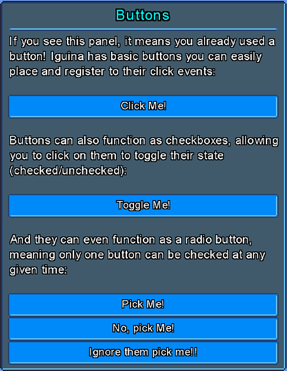

Clickable buttons. 

Buttons inherit from the `CheckedEntity` base class, which means you can make buttons toggleable and behave like a checkbox or a radio button, by enabling the `ToggleCheckOnClick` and `ExclusiveSelection` flags.

## Checkbox

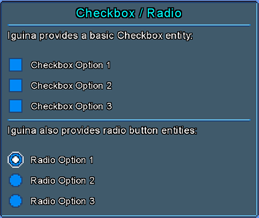

A toggleable checkbox, with a box to indicate state and a label.

`Checkbox` inherits from the `CheckedEntity` base class.

## RadioButton

A toggleable radio button, with a box to indicate state and a label.
This entity is like a `Checkbox`, but it uses different default stylesheets, and by default it has `ExclusiveSelection` = true, and `CanClickToUncheck` = false.

`RadioButton` inherits from the `CheckedEntity` base class.

## ListBox

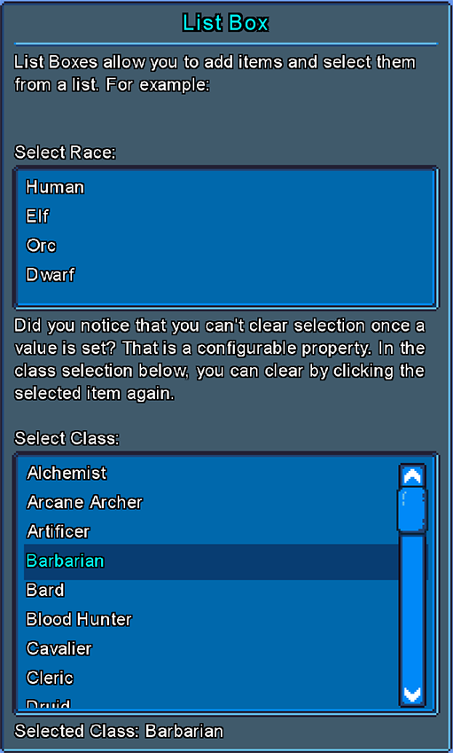

A list of string items that users can select items from.

`ListBox` adds the following additional properties:

### `ItemsCount`

How many items are in list.

### `SelectedIndex`

Currently selected list index, or -1 if no item is selected.

### `SelectedValue`

Currently selected item value, or null if no item is selected.

### `SelectedText`

Return selected value label, or value itself if it has no label.
Will return null if no value is selected.

### `AllowDeselect`

If true, users can click on selected item again to deselect it.

### `AddItem(value, label?, index?)`

Adds an item to the list.

### `ReplaceItem(index, value, label?)`

Replace an existing item in the list.

### `RemoveItem(value)` / `RemoveItem(index)`

Removes a value from the list.

### `Clear()`

Remove all values from list.

## DropDown

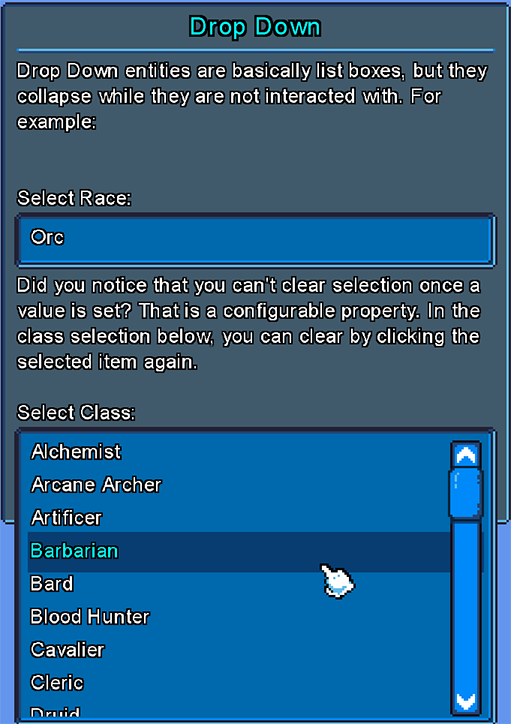

`DropDown` entity is a derived class of `ListBox`, that collapses into a single line when not interacted with.
Its a way to take less space for lists.

## HorizontalLine

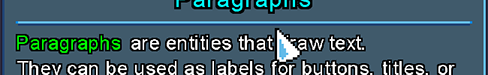

This entity is just a graphical horizontal line to separate between sections.

## VerticalLines

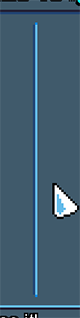

This entity is just a graphical vertical line to separate between sections.

## Panel

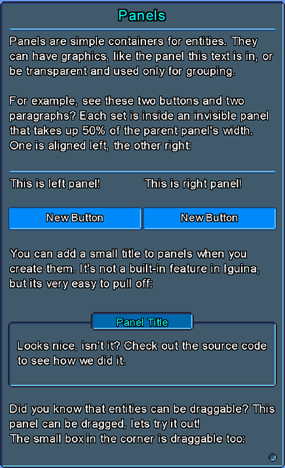

Panels are graphical containers of entities, like a windows form or a group box.

## Paragraph

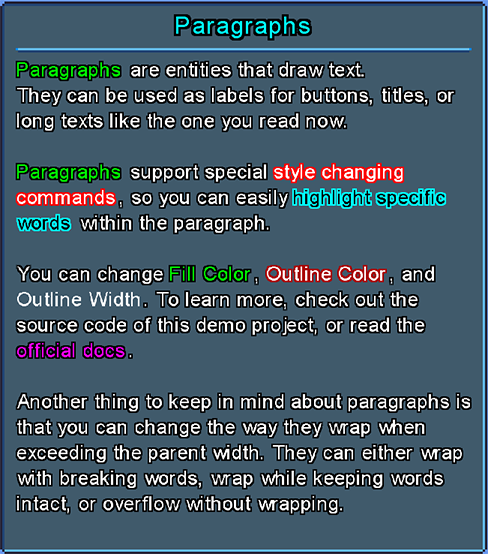

An entity used to render text.

`Paragraph` adds the following additional properties:

### `Text`

String to render.

### `EnableStyleCommands`

If true, will enable paragraph style commands.

Style commands are special flags you can set inside the text to change paragraph colors and outline mid-sentence.
A style command is defined between `${}`. The following commands are supported:

* **FC:RRGGBBAA**                           Change fill color. RRGGBBAA is the color components in hex. AA is optional.
* **OC:RRGGBBAA**                           Change outline color. RRGGBBAA is the color components in hex. AA is optional.
* **OW:Width**                              Change outline width. Width is the new outline width.
* **ICO:Texture|sx|sy|sw|sh|scale|utc**     Embed an icon inside the text, with texture id, source rect, and scale. Utc is an optional flag (can be 'y' or 'n') if to use text color for icon.
* **RESET**                                 Reset all previously-set style command properties.

For example, the following code:

```cs
paragraph.Text = "Hello, ${FC:00FF00}Hero${RESET}! Welcome to my ${OC:FF00FF,OW:2}cave${RESET}."
```

Will render a `Paragraph` with the word 'Hero' marked in green fill color, and the word 'cave' will have outline of 2 pixels with purple color.

### `ShrinkWidthToMinimalSize` / `ShrinkHeightToMinimalSize`

If true (default) it will minimize the `Paragraph` entity size to match the actual rendered text size.

### `TextOverflowMode`

Determine how to handle a text that overflows the parent entity width:

- **Overflow**: text will just overflow parent width.
- **WrapWords**: text will break while keeping full words intact.
- **WrapImmediate**: text will break on the first character that overflows the parent width.

## Title

`Title` entity is a derived class of `Paragraph`, but it uses different default stylesheets and used for texts that are titles for sections or panels.

## Label

`Label` entity is a derived class of `Paragraph`, but it uses different default stylesheets and used for smaller texts above input entities.

## Slider

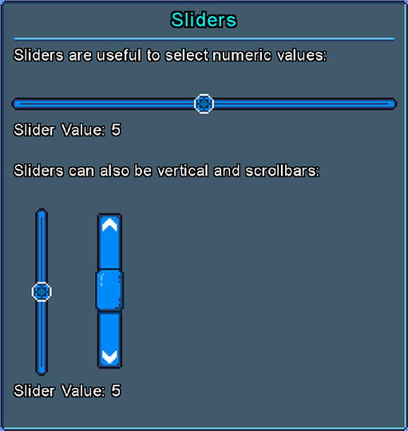

A slider to pick numeric integer values, using a draggable handle confined to a track it drags on.
It can be Vertical or Horizontal (determined in constructor).

`Slider` adds the following additional properties:

### `Handle`

The internal handle entity.

### `Orientation`

Slider Orientation (vertical / horizontal).

### `MouseWheelStep`

How much to change the slider value when the mouse scrolls on it.

### `MinValue`

Slider min value.

### `MaxValue`

Slider max value.

### `Value`

Slider current value.

### `ValueSafe`

Slider current value, that you can set without exceptions (value will be clamped to min/max).

### `StepsCount`

How many steps there are on the slider.

### `ValuePercent`

Get current value as percent between 0.0 to 1.0.

### `FlippedDirection`

If true, will flip slider direction.

### `ValueRange`

Value range (max - min).

## ProgressBar

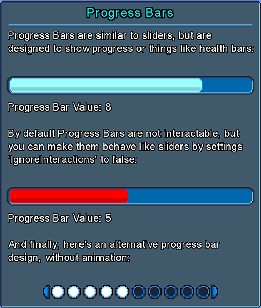

`ProgressBar` entity is a derived class of `Slider`, but instead of dragging an handle it 'fills' an internal entity based on value.

## TextInput

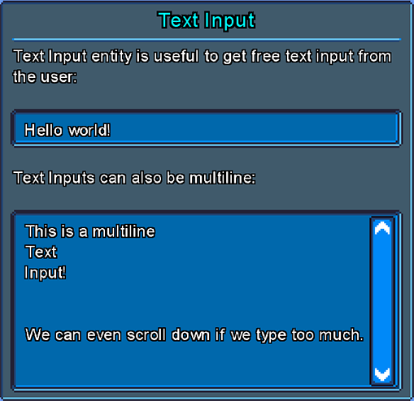

An entity to get free text input from users.

`TextInput` adds the following additional properties:

### `PlaceholderText`

Optional text to show when there's no value in the text input.

### `Value`

Current text value.

### `Multiline`

If true, text input will support line breaks.

### `MaxLines`

Optional lines limit.

### `MaxLength`

Optional max length limit.

### `CaretOffset`

Caret offset.

### `CaretCharacter`

Character to use to show caret.

### `MaskingCharacter`

If provided, will replace all characters with this character when presenting the input text.
Useful for stuff like passwords input field, where you want the password hidden.

## NumericInput

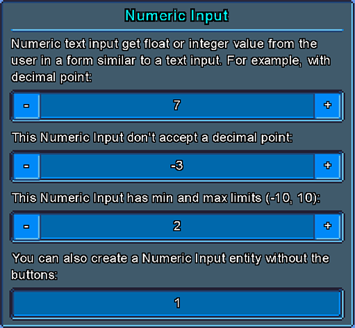

`NumericInput` entity is a derived class of `TextInput`, but it only accept numbers as input.

### `NumericValue`

Get / set value as a float.

### `DefaultValue`

Default numeric value, when no value is set.

### `CultureInfo`

Culture info to use, will determine the character to use as decimal separator. 

### `AcceptsDecimal`

If true, it will accept decimal point and float values.

### `MinValue`

If defined, will add a min value limit to the Numeric Input.

### `MaxValue`

If defined, will add a max value limit to the Numeric Input.

### `ButtonsStepSize`

How much to increase / decrease value when clicking on the plus / minus buttons of the numeric input field.

## RowsSpacer

An empty entity that creates an extra space between rows of entities, with constant space unit that can be defined by the UI system stylesheet `RowSpaceHeight` property.

## ColorSlider

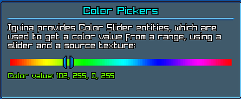

`ColorSlider` entity is a derived class of `Slider`, but used to pick a color value from a range.
The returned color is based on the source texture and source rectangle used to render the slider itself.

With Colors slider you don't need to set Min, Max, or Step Counts properties. They are set automatically.

### `ColorValue`

Return the color value, as extracted from the source texture.

## ColorPicker

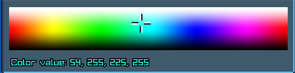

`ColorPicker` is used to pick a source color from a texture, by dragging a handle over it.
The default UI theme comes with a texture that covers all basic colors, effectively creating a color picker similar to painting software. However, you can replace this picker with a palette of your choice.

Color picker must have a stretched texture in its stylesheet, which is used as its source texture.

### `ColorValue`

Return the color value, as extracted from the source texture.

### `SetHandleOffset()`

Set handle offset, in pixels, from top-left corner of the entity.

# MessageBoxUtils

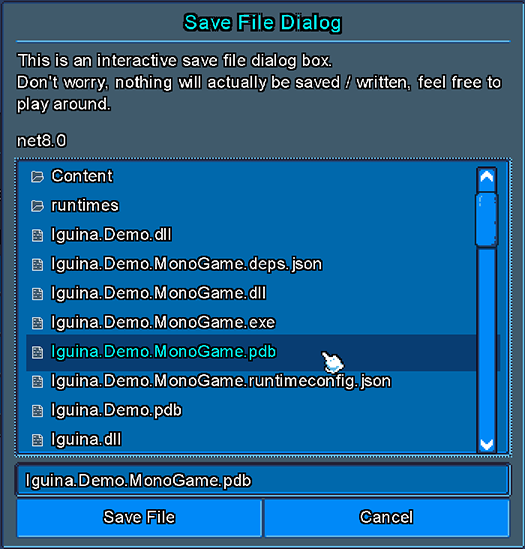

A utility to show message boxes and file dialogs.

## `ShowConfirmMessageBox()`

Show a prompt with Confirm vs Cancel buttons.

## `ShowInfoMessageBox()`

Show info message box with just text and OK button.

## `ShowSaveFileDialog()`

Show save file dialog, that returns selected file path (or null if user cancelled).

## `ShowOpenFileDialog()`

Show open file dialog, that returns selected file path (or null if user cancelled).
This is very similar to `ShowSaveFileDialog()` but with different default flags and designed to select an existing files rather than creating a new file or overriding old one.

# Changelist

## 1.0.1

- Added `SelectedText` property to `ListBox` and `DropDown`.
- Fixed `DropDown` to properly show the selected item label (if set) and not just the item value.
- Adjusted `ListBox` and `DropDown` to change selection value if the selected item value is replaced.
- Added `OverrideSelectedText` property to `DropDown`.

## 1.0.2

- Added `Label` entity.
- Added the ability to override styles for items and selected items in `ListBox` and `DropDown`.
- Set `DropDown` to `Auto Height` by default.
- Refactored `DropDown` to always show selected value and look more like a 'classic' dropdown.
- Added `BoxOutlineWidth`, `BoxOutlineOffset` and `BoxOutlineColor` property to entities.
- Made Paragraphs ignore user interactions by default.
- Made `DropDown` collision rectangle slightly larger to make it more convenient.
- Added `SetVisibleItemsCount()` method to `ListBox` and `DropDown`.
- Added methods to `DropDown` to open, close and toggle list.

## 1.0.3

- Made `HorizontalLine` ignore interactions by default.
- Added entity to create empty spaces between rows.
- Fixed auto sizes to take `MarginAfter` property into calculation.
- Improved debug drawing entities.
- Updated demo project.

## 1.0.4

- Added utility to generate message boxes.
- Added `BackgroundColor` stylesheet property.
- Renamed `FillColor` stylesheet property.
- Updated stylesheet.

## 1.0.5

- Added `NumericInput` entity.
- Added index property when adding child.
- Small improvements to Message Boxes.
- Added `MaskingCharacter` to `TextInput`.
- Added small extra margin to scissor region to make sure text outline don't get cut off.
- Made `TextInput` less "sticky" to be kept focused.

## 1.0.6

- Added stylesheet inheritance and changed default theme to utilize it.
- Added `VerticalLine` entity.
- Added global text scale factor.
- Added global cursor scale factor.
- Added TextScale stylesheet property.
- Added option to set Minus / Plus buttons text in a Numeric Input.
- Made Minus / Plus buttons in Numeric Input use the `MarginBefore` and `MarginAfter` properties for positioning.
- Improved the way we render framed textures.
- Added arrow icon to `DropDown` entities.
- Added the ability to embed icons inside texts using style commands.

## 1.0.8

- Upgraded .net version to `8.0`.

## 1.0.9

- Fixed Paragraph icons to use text scale global factor.
- Added another fallback to Paragraph stylesheet for ListBox items, just in case a user accidentally provided null in the constructor.
- Added method to set ListBox label with icon.
- Added methods to push entity to back or front.
- Made it safe to add / remove entities while iterating them, to prevent exceptions if changing entities tree from events.
- Made entities bring themselves to front when they are being dragged.

## 1.0.10

- Added `ColorSlider` entity.
- Added `ColorPicker` entity.

## 1.0.11

- Fixed bug with list / dropdown label icons with `MonoGame` renderer.

## 1.0.12

- Improved the way `ColorPicker` and `ColorSlider` works internally, now its possible to set their starting value without waiting for an update first.
- Added the ability to set `ColorSlider` and `ColorPicker` values from a given color.
- Added the `IColorPicker` interface.

## 1.0.13

- Fixed a bug with `NumericInput` having wrong value during the `OnChange` event call.
- Fixed a bug with `NumericInput` not being able to accept values that start with '0.'.
- General improvements to `NumericInput` input normalization.
- Added identifiers to message box generated entities.
- Fixed issue that some panels flicker when they appear for the first time for a single frame.
- Added some unit tests.

## 1.0.14

- Added `MeasureVector.FromPixels` and `MeasureVector.FromPercents` methods.
- Added demo example with external animations (Morpheus).
- Added `ShowInfoMessageBox` to message box utility.

## 1.1.0

**Breaking Changes**

- Renamed 'Focus' related properties.
- Changed default built-in theme.
- Added method to implement in input provider.
- Changed the value returned from lists `SelectedText`.
- Added 'focused entity' behavior for systems (can be disabled).

All changes:

- Added `InvokeOnUIThread` to handle concurrency properly.
- Added focused entities mechanism.
- Added `Focused` entity style.
- Added single-thread validations in debug mode.
- Added system-level UI icons.
- Added open files dialog boxes.
- Made list paragraphs propagate mouse events to parent list, so list mouse events can be properly used. 
- Added basic keyboard interactions with focused entity.
- Added method to set list scrollbar offset to selected item.
- Added `SelectedTextWithIcon` to `ListBox` and changed `SelectedText` to not include icons data.
- Added `Offset`, `CenterVertically` and `CenterHorizontally` properties to icons.
- Made built-in UI theme more compact and clean.
- Updated dependencies.

# 1.1.1

- Added option to make base entities interactable.
- Added option to override cursor properties.
- Added paragraph style command to change text offset (useful to align labels).
- Added method `ClearChildren()`.
- Added `InteractableTargetedEntity` to get `TargetedEntity`, but only if its interactable.

# License

`Iguina` is distributed with the permissive MIT license. 
You can use it for any purpose.

The UI theme in the demo project is made by me and its public domain.