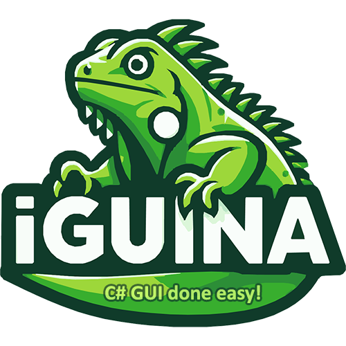

# Iguina

`Iguina` is a framework-agnostic, cross-platform, modern UI system for C#.

It's a spiritual successor to the [GeonBit.UI](https://github.com/RonenNess/GeonBit.UI) library, but it takes a more flexible and modern approach and can be used with any framework, not just `MonoGame`.

## Table Of Contents

Getting to know `Iguina`:

* [Introduction](#introduction)
* [Installation](#installation)
* [Demo Projects](#demo-projects)
* [Quick Examples](#quick-examples)
* [Basic Concepts](#iguina-basic-concepts)

Writing drivers and a UI theme (only required if you don't use the built-in drivers and UI theme from the demo projects):

* [Writing Drivers](#writing-drivers)
  * [Renderer](#renderer)
  * [Input Provider](#input-provider)
  * [Files Provider](#files-provider)
* [Writing Stylesheets](#writing-stylesheets)
  * [Stylesheet Types](#stylesheet-types)
  * [System Level Stylesheet](#system-level-stylesheet)
  * [Entities Stylesheet](#entities-stylesheet)

Using `Iguina` in your application:

* [Iguina Setup](#iguina-setup)
* [The UI System](#iguina-ui-system)
* [UI Entities](#iguina-ui-entities)
* [Message Boxes & File Dialogs](#messageboxutils)
* [How To...](#how-to)
* [Tips & Gotchas](#tips--gotchas)

Misc:

* [Using with Android & MonoGame](#using-with-android--monogame)
* [Changelist](#changelist)
* [License](#license)


# Introduction

## Key Features

`Iguina` provides the following key features:

* UI layout with constant / automatic anchors, and relative sizing for responsiveness.
* All the basic UI elements you need for a game or an editor:
    * Panels.
    * Buttons.
    * Sliders.
    * Progress Bars (horizontal and vertical).
    * Scrollbars.
    * Paragraphs, Titles, and Labels.
    * Checkboxes.
    * Radio Buttons.
    * List Box.
    * Drop Down List.
    * Text Input.
    * Numeric Input.
    * Horizontal / Vertical Lines.
    * Message Boxes & file dialogs.
    * Color Slider, Color Picker and Color Buttons.
* Extensive stylesheet system to load an entire UI theme from files.
* Smooth transitions and animations.
* Cursor styles and handling.
* Keyboard interactions with the focused entity.
* Events system to register to any UI event and respond accordingly.
* Draggable entities.
* A free, public domain UI theme that comes with the demo.

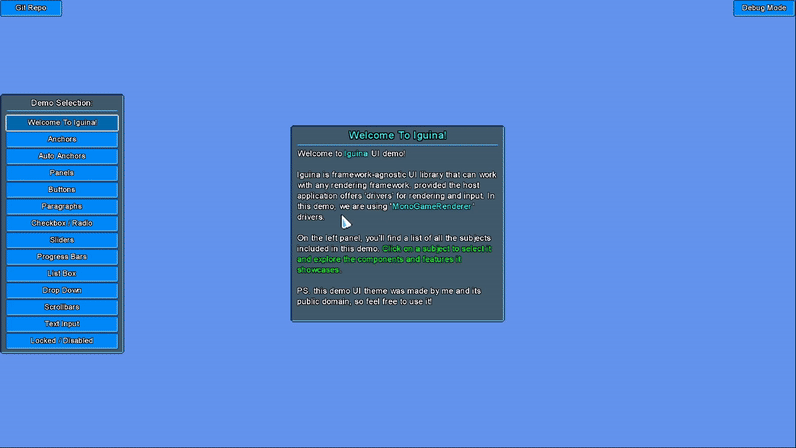

## GeonBit.UI vs Iguina

If you have a `MonoGame` project and you're already using [GeonBit.UI](https://github.com/RonenNess/GeonBit.UI), it's probably not worth the effort to switch to `Iguina`. Also keep in mind that not all `GeonBit.UI` features are currently supported in `Iguina`.

However, you should pick `Iguina` over `GeonBit.UI` in the following cases:

- **For a new project.** `Iguina` will be maintained for longer, has leaner and more modern APIs, and is *not* dependent on `MonoGame` and its content manager.
- **For projects that don't use MonoGame.** `Iguina` is completely framework-agnostic and can be used with `RayLib`, `SFML`, `SDL` or any other alternative.
- **If you need any of the new features.** `Iguina` introduces some new features, including animations, cursor stylesheets, non-monospace font support, and much more.
- **For cross-platform projects.** `Iguina` has a more flexible design and can be ported more easily to any framework or device.

## Integration

To stay framework-agnostic, `Iguina` requires the host application to provide a 'drivers' layer. There are two drivers to implement:

- **Renderer**: an object that implements basic 2D rendering.
- **Input Provider**: an object that provides basic mouse and keyboard input.

That's all `Iguina` needs to work. You can use whatever framework you want for rendering and whatever method you want for input, and just expose this functionality to `Iguina` via the drivers.

For gamepads and other input methods that are not mouse / keyboard based, you can emulate mouse movement and clicks, and the UI will work normally. For example, gamepad sticks can emulate mouse movement, and triggers can emulate mouse clicks.

# Installation

`Iguina` is available as a NuGet package:

```
dotnet add package Iguina
```

Or you can clone this repository and add the `Iguina/Iguina.csproj` project to your solution.

You will also need drivers for your framework of choice (see [Demo Projects](#demo-projects) and [Writing Drivers](#writing-drivers)), and a UI theme. You can start with the built-in theme found in `Iguina.Demo/Assets/DefaultTheme/`.

# Demo Projects

`Iguina` includes a generic demo project located in the `Iguina.Demo/` folder. This project receives drivers as input and builds an example UI, without depending on any specific rendering or input layer. This is also where you'll find the built-in free UI theme (under `Assets/DefaultTheme`).

In addition to the generic demo project (which is a DLL), `Iguina` provides two executable demo projects that use it: one for `MonoGame` and another for `RayLib`.

You can take the `Renderer` and `Input Provider` implementations from these demos and use them in your own projects, as they offer a solid starting point. Or you can implement your own, which is quite easy to do.

Note: if you use the demo drivers, be aware that text outline rendering is done in a quick-and-dirty way (rendering the string multiple times with offsets).
You may want to replace that with a proper shader, but it's not mandatory.

# Quick Examples

Before we learn about `Iguina` and how to use it, let's see a quick example with `MonoGame` and `RayLib`.
Note: the drivers used here are not shown. They can be found in the demo projects, along with many other `Iguina` examples. Check them out.

## MonoGame

```cs
using Iguina;
using Iguina.Defs;
using Iguina.Entities;

/// <summary>
/// Basic monogame example.
/// </summary>
public class IguinaMonoGameExample : Game
{
    private GraphicsDeviceManager _graphics = null!;
    private SpriteBatch _spriteBatch = null!;
    UISystem _uiSystem = null!;

    public IguinaMonoGameExample()
    {
        _graphics = new GraphicsDeviceManager(this);
        Content.RootDirectory = "Content";
        IsMouseVisible = true;
        Window.Title = "Iguina Demo - MonoGame";
    }

    protected override void Initialize()
    {
        base.Initialize();
    }

    protected override void LoadContent()
    {
        _spriteBatch = new SpriteBatch(GraphicsDevice);

        // path of the UI theme to load
        var uiThemeFolder = "../../../../Iguina.Demo/Assets/DefaultTheme";

        // create ui system with our renderer and input provider
        var renderer = new MonoGameRenderer(Content, GraphicsDevice, _spriteBatch, uiThemeFolder);
        var input = new MonoGameInput();
        _uiSystem = new UISystem(Path.Combine(uiThemeFolder, "system_style.json"), renderer, input);

        // create panel with hello message
        {
            var panel = new Panel(_uiSystem);
            panel.Anchor = Anchor.Center;
            panel.Size.SetPixels(400, 400);
            _uiSystem.Root.AddChild(panel);

            var paragraph = new Paragraph(_uiSystem);
            paragraph.Text = "Hello World!";
            panel.AddChild(paragraph);
        }
    }

    protected override void Update(GameTime gameTime)
    {
        if (GamePad.GetState(PlayerIndex.One).Buttons.Back == ButtonState.Pressed || Keyboard.GetState().IsKeyDown(Keys.Escape))
            Exit();

        // update input and ui system
        var input = (_uiSystem.Input as MonoGameInput)!;
        input.StartFrame(gameTime);
        _uiSystem.Update((float)gameTime.ElapsedGameTime.TotalSeconds);
        input.EndFrame();

        base.Update(gameTime);
    }

    protected override void Draw(GameTime gameTime)
    {
        GraphicsDevice.Clear(Microsoft.Xna.Framework.Color.CornflowerBlue);

        // render ui
        var renderer = (_uiSystem.Renderer as MonoGameRenderer)!;
        renderer.StartFrame();
        _uiSystem.Draw();
        renderer.EndFrame();

        base.Draw(gameTime);
    }
}
```

The result should look like this (provided you took the `MonoGame` drivers from the demo project first):

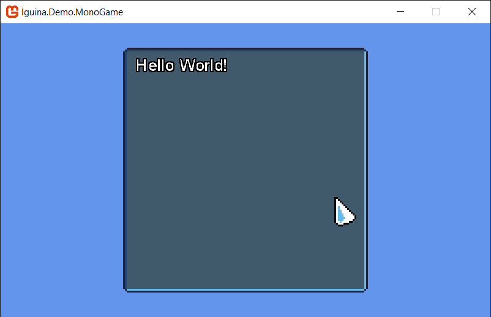

## RayLib

```cs
using Iguina.Defs;
using Iguina.Entities;
using Raylib_cs;
using static Raylib_cs.Raylib;

// demo window size
int screenWidth = 800;
int screenHeight = 600;

// init window
Raylib.SetConfigFlags(ConfigFlags.Msaa4xHint | ConfigFlags.ResizableWindow);
InitWindow(screenWidth, screenHeight, "Iguina.Demo.RayLib");

// create ui system with our renderer and input provider
var uiThemeFolder = "../../../../Iguina.Demo/Assets/DefaultTheme";
var renderer = new RayLibRenderer(uiThemeFolder);
var input = new RayLibInput();
var uiSystem = new Iguina.UISystem(Path.Combine(uiThemeFolder, "system_style.json"), renderer, input);

// create panel with hello message
{
    var panel = new Panel(uiSystem);
    panel.Anchor = Anchor.Center;
    panel.Size.SetPixels(400, 400);
    uiSystem.Root.AddChild(panel);

    var paragraph = new Paragraph(uiSystem);
    paragraph.Text = "Hello World!";
    panel.AddChild(paragraph);
}

// main game loop
while (!WindowShouldClose())
{
    // begin drawing
    BeginDrawing();
    ClearBackground(Raylib_cs.Color.DarkBlue);

    // update and draw ui
    BeginMode2D(new Camera2D() { Zoom = 1f });
    renderer.StartFrame();
    uiSystem.Update(GetFrameTime());
    uiSystem.Draw();
    renderer.EndFrame();
    EndMode2D();

    // end drawing
    EndDrawing();
}

CloseWindow();
Environment.Exit(0);
```

The result should look like this (provided you took the `RayLib` drivers from the demo project first):

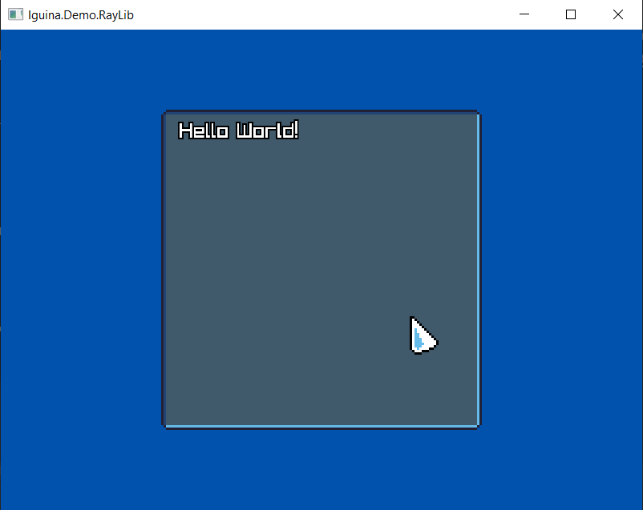

# Iguina Basic Concepts

Before we dive into code, let's go over some basic concepts of `Iguina`.

## UI System

`UISystem` is the main object that manages and runs a UI instance. This includes the UI style, all its entities, events, etc.
You can run multiple `UISystem`s at the same time, but usually that won't be necessary.

The `UISystem` contains a `Root` entity, which is the top element of the UI tree. You add your entities to it.

## Entities

Every UI element type is an `Entity`, and you can add any entity type as a child of any other entity.

Entities are organized in a tree: every entity has a parent (except for `Root`) and can have any number of children. An entity's position and size are calculated relative to its parent, and hiding, disabling or locking an entity also affects all of its children.

## Anchors

`Iguina` positions entities using **Anchors**. An anchor determines which side or point of the parent entity the entity sticks to.

These are the constant anchors you can position entities with:

- **TopLeft**: The entity's top-left corner is placed on the parent's internal top-left corner.
- **TopCenter**: The entity's top-center point is placed on the parent's internal top-center point.
- **TopRight**: The entity's top-right corner is placed on the parent's internal top-right corner.
- **BottomLeft**: The entity's bottom-left corner is placed on the parent's internal bottom-left corner.
- **BottomCenter**: The entity's bottom-center point is placed on the parent's internal bottom-center point.
- **BottomRight**: The entity's bottom-right corner is placed on the parent's internal bottom-right corner.
- **CenterLeft**: The entity's center-left point is placed on the parent's internal center-left point.
- **Center**: The entity's center point is placed on the parent's internal center point.
- **CenterRight**: The entity's center-right point is placed on the parent's internal center-right point.

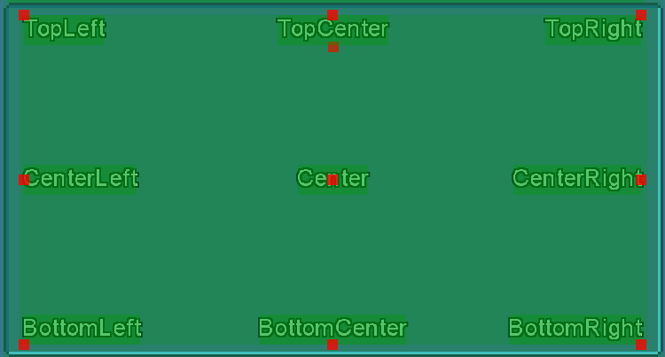

In addition, there are 'Auto Anchors', which position entities automatically, relative to the entity that was added before them in the same parent:

- **AutoLTR**: Places entities one under another, aligned to the left (left-to-right). This is the default anchor for most entities.
- **AutoInlineLTR**: Places entities next to each other in the same row, going left-to-right. When an entity doesn't fit in the parent's width, it wraps to the next row.
- **AutoRTL**: Places entities one under another, aligned to the right (right-to-left).
- **AutoInlineRTL**: Places entities next to each other in the same row, going right-to-left. When an entity doesn't fit in the parent's width, it wraps to the next row.
- **AutoCenter**: Places entities one under another, aligned to the center.

> **Note**: auto anchors are always calculated relative to the *previous visible sibling*, regardless of that sibling's own anchor. For example, if you add an `AutoLTR` entity right after an entity anchored to `BottomLeft`, it will be placed below the bottom-left entity. To avoid surprises, add entities with constant anchors after the auto-anchored ones, or wrap them in a separate panel.

### Offset

Entities also have an offset from the anchor they are aligned to.
The offset always points "inwards", away from the side the entity is anchored to. For example, an offset of `{x:10, y:0}` with a `TopRight` anchor means the entity sticks to the parent's top-right internal corner and moves 10 pixels to the *left* of it. With `BottomLeft`, a positive `Y` offset moves the entity *up*.

Offsets can be in pixels, or in percent of the parent entity's size.

```cs
entity.Offset.X.SetPixels(10);
entity.Offset.Y.SetPercents(5f);
```

## Sizing

Like offsets, entity sizes can be in pixels, or in percent of the parent entity's internal size (its size minus padding).

```cs
entity.Size.SetPixels(300, 200);        // both axes in pixels
entity.Size.X.SetPercents(50f);         // 50% of the parent's internal width
entity.Size.Y.SetPixels(120);           // 120 pixels height
entity.Size = MeasureVector.FromPercents(100f, 25f);
```

Every entity type has its own default size and anchor. Stylesheets can also define default sizes and anchors (covered [later](#entities-stylesheet)), which take priority over the entity type defaults.

You can also let an entity size itself based on its children, using [`AutoWidth` / `AutoHeight`](#autowidth--autoheight).

## Stylesheets

A stylesheet is an object that defines how to render, size, and position a UI entity. Stylesheets define the entire appearance of your UI, and you can create them via code or load them from JSON files.

To learn more, check out the stylesheets of the [demo project UI theme](Iguina.Demo/Assets/DefaultTheme/Styles/). We explain how to write stylesheets in detail [later in this doc](#writing-stylesheets).

## Entity States

Every UI entity has a 'state' indicating its current interaction with the user.
Stylesheets can define different graphics per state, and the transition between states can be immediate or smooth (animated).

Every entity can have the following states:

- **Default**: the default state, when the entity is not being interacted with.
- **Targeted**: the entity is currently targeted by the user, i.e. the mouse points at it.
- **Interacted**: the user is currently interacting with the entity. For example, for buttons it means the user is pressing down on it.
- **Focused**: the entity is focused, since it's the last entity the user interacted with, and it accepts keyboard interactions.
- **Checked**: for entities that have a checked state (buttons, checkboxes, radio buttons), this is the state when the entity is checked.
- **TargetedChecked**: the entity is checked *and* targeted by the user.
- **Disabled**: the entity is disabled.
- **DisabledChecked**: the entity is checked *and* disabled.

You don't have to define graphics for every state. When a property is not defined for a state, it falls back to other states, and eventually all the way back to `Default`.

This is the fallback order of states when properties are missing from a stylesheet:

- **Default** -> hard-coded default values.
- **Targeted** -> Default.
- **Interacted** -> Default.
- **Focused** -> Default.
- **Checked** -> Interacted -> Default.
- **TargetedChecked** -> Checked -> Interacted -> Default.
- **Disabled** -> Default.
- **DisabledChecked** -> Disabled -> Default.


# Writing Drivers

As mentioned before, to use `Iguina` your host application needs to provide the UI system with *drivers*.
There are two drivers to implement:

- **Iguina.Drivers.IRenderer**: responsible for rendering the UI with whatever framework you use.
- **Iguina.Drivers.IInputProvider**: responsible for providing user input to the UI system.

If you need an off-the-shelf implementation for `MonoGame` or `RayLib`, you can find them here:

- **MonoGame**: [Renderer](Iguina.Demo.MonoGame/MonoGameRenderer.cs) / [Input Provider](Iguina.Demo.MonoGame/MonoGameInput.cs).
- **RayLib**: [Renderer](Iguina.Demo.RayLib/RayLibRenderer.cs) / [Input Provider](Iguina.Demo.RayLib/RayLibInput.cs).

Just copy them into your project and you're good to go. For `MonoGame`, be sure to copy the content assets (fonts and effects) as well.

If you want to implement your own drivers or use a framework not covered here, read on.

## Renderer

The Renderer (`Iguina.Drivers.IRenderer`) is responsible for rendering textures and text, and is what gives `Iguina` the ability to present itself on screen.

When implementing the `Renderer`, you need to implement the following methods:

### `Rectangle GetScreenBounds();`

Return a rectangle representing the visible region we can render on.
Normally this should return `Rectangle(0, 0, WindowWidth, WindowHeight)`, but if you want the UI to cover only part of the screen, you can return an offset and / or a smaller width and height.

The UI system sets the `Root` entity size to this region every update.

### `void DrawTexture(string? effectIdentifier, string textureId, Rectangle destRect, Rectangle sourceRect, Color color);`

Render a 2D texture on screen. This is one of the main methods `Iguina` uses to render itself.

**Parameters**:

- **effectIdentifier**: The effect identifier to use, or null for plain rendering without any special effects. This value comes from the stylesheets. For example, the demo project has an effect called 'disabled', used for the disabled state, that renders everything in greyscale.
- **textureId**: Texture id to render. This value comes from the stylesheets. It can be a full path or just a name, it's up to you. The driver is responsible for figuring out which texture to use from this id, and loading it if needed.
- **destRect**: The destination rectangle, in screen pixels, to draw the texture on.
- **sourceRect**: The source rectangle, in pixels, to draw from the texture.
- **color**: Tint color to draw the texture with. The final color should be `texelColor * color`.

### `Point MeasureText(string text, string? fontId, int fontSize, float spacing);`

Measure the actual size, in pixels, of a string, given a font, size and spacing factor.

- **text**: String to measure.
- **fontId**: Which font to use, or null for the default font. This value comes from the stylesheets. The driver is responsible for figuring out which font to use from this id, and loading it if needed.
- **fontSize**: Font size to measure.
- **spacing**: Spacing factor between characters (1 = default font spacing).

### `int GetTextLineHeight(string? fontId, int fontSize);`

Measure the line height, in pixels, of a given font id and size.
In most cases, this can be implemented like this:

```cs
return MeasureText("A", fontId, fontSize, 0f).Y;
```

### `void DrawText(string? effectIdentifier, string text, string? fontId, int fontSize, Point position, Color fillColor, Color outlineColor, int outlineWidth, float spacing);`

Render 2D text on screen. This is one of the main methods `Iguina` uses to render itself.

**Parameters**:

- **effectIdentifier**: The effect identifier to use, or null for plain rendering without any special effects. This value comes from the stylesheets.
- **text**: String to render.
- **fontId**: Which font to use, or null for the default font. This value comes from the stylesheets. The driver is responsible for figuring out which font to use from this id, and loading it if needed.
- **fontSize**: Font size to render with.
- **position**: Top-left position to start rendering the text from.
- **fillColor**: Text fill color.
- **outlineColor**: Text outline color. Note that its alpha may be 0, in which case you shouldn't render an outline.
- **outlineWidth**: Text outline width. Note that it may be 0, in which case you shouldn't render an outline.
- **spacing**: Character spacing factor (1 = default font spacing).

Note: in the default driver implementations for both `RayLib` and `MonoGame`, the outline is produced by rendering the string multiple times with pixel offsets, and then drawing the fill on top. This is less efficient and doesn't look great at low opacity. Replacing it with a proper shader is recommended, but not mandatory.

### `void DrawRectangle(Rectangle rectangle, Color color);`

Render a filled, colored rectangle on screen.
This method is used for `BackgroundColor`, box outlines, and debug draw mode.

### `void SetScissorRegion(Rectangle region);`

Set a region on screen, in pixels, that we can render on. Anything rendered outside this region should not appear.
This method is used to implement the hidden overflow mode, for example in panels with scrollbars.

If you don't implement this method properly (i.e. leave it empty), everything will still work, but entities that exceed their parent's bounds will be visible instead of hidden.

### `Rectangle? GetScissorRegion();`

Get the currently set scissor region, or null if no limit is set.

### `void ClearScissorRegion();`

Clear the previously set scissor region, allowing rendering on the entire screen.

### `Color GetPixelFromTexture(string textureId, Point sourcePosition);`

Return the color of a pixel from a texture id and a position in that texture.
This method is used by the color picker entities (`ColorSlider` and `ColorPicker`). If you don't use them, you can just return a constant value.

### `Point? FindPixelOffsetInTexture(string textureId, Rectangle sourceRect, Color color, bool returnNearestColor);`

Return the offset of a pixel in a texture's source rectangle that matches the given color (relative to the top-left corner of the source rectangle), or null if not found. If `returnNearestColor` is true and the exact color is not found, return the offset of the nearest color instead.
This method is used by the color picker entities to set their value from a color. If you don't need it, you can just return null.

## Input Provider

The Input Provider (`Iguina.Drivers.IInputProvider`) is responsible for passing user input to the UI system. This includes mouse, keyboard, and text typing input.

While the input provider interface is designed mainly around keyboard and mouse, you can implement it internally for any kind of input device. For example, you can translate gamepad movement into mouse movement to control the UI with a gamepad.

When implementing the `Input Provider`, you need to implement the following methods:

### `Point GetMousePosition();`

Return the current mouse position, in pixels, as an offset from your window's top-left corner.

### `bool IsMouseButtonDown(MouseButton btn);`

Return whether a mouse button (`Left`, `Right` or `Wheel`) is currently being pressed down.

### `int GetMouseWheelChange();`

Return whether the mouse wheel was scrolled this frame:

- If the mouse wheel is scrolled up, return -1.
- If the mouse wheel is scrolled down, return 1.
- If the mouse wheel is not scrolled, return 0.

### `int[] GetTextInput();`

Return the unicode values of all the characters typed by the user during this update call.
This method is a bit tricky, as you also need to handle the *repeat delay* and *repeat rate*:

- **Repeat Delay** is how long to wait before starting to repeat a character while its key is held down.
- **Repeat Rate** is how fast to add more instances of a character while its key is held down, after the initial repeat delay is over.

If you play with any text editor, you'll notice these two values are not the same.
`Iguina` does not limit typing speed by itself, so without a proper delay and rate limit, characters will be typed too fast.

Notes:

* This method does not handle commands such as line break, delete, etc. These are handled separately by `GetTextInputCommands()`.
* This method should handle upper case, for example when shift is held down.

This method is perhaps the most complicated part of implementing `Iguina` drivers.

### `TextInputCommands[] GetTextInputCommands();`

Similar to `GetTextInput`, but for special typing commands. As with `GetTextInput`, you're responsible for the repeat delay and rate.
The supported commands are:

- `MoveCaretLeft`, `MoveCaretRight`, `MoveCaretUp`, `MoveCaretDown` (typically arrow keys).
- `Backspace`, `Delete`.
- `BreakLine` (typically Enter).
- `MoveCaretStart`, `MoveCaretEnd` (typically Ctrl + Home / Ctrl + End).
- `MoveCaretStartOfLine`, `MoveCaretEndOfLine` (typically Home / End).

### `KeyboardInteractions? GetKeyboardInteraction();`

Return the current keyboard-based interaction, or null if there is none. These interactions are applied to the currently focused entity (for example, changing a slider value with the arrow keys, or clicking a focused button with Enter).
The supported interactions are `MoveUp`, `MoveDown`, `MoveLeft`, `MoveRight` (typically arrow keys) and `Select` (typically Space / Enter).

Return the interaction for as long as its key is held down. `Iguina` detects the moment it was pressed by itself.

## Files Provider

The Files Provider (`Iguina.Drivers.IFilesProvider`) is an optional third driver that controls how `Iguina` reads text files (stylesheets, theme data, etc.). If you don't provide one, `Iguina` uses the built-in `DefaultFilesProvider`, which reads from the local file system.

Implement this interface to load files from a custom source, such as a zip archive, an embedded resource, or a network store.

### `string ReadAllText(string path);`

Return the full text content of the file at the given path. The path is built from the paths in your stylesheets (typically relative file paths, combined with the folder of the system stylesheet).

Pass your custom provider when creating the UI system:

```cs
var myProvider = new MyCustomFilesProvider();
var uiSystem = new UISystem(Path.Combine(uiThemeFolder, "system_style.json"), renderer, input, myProvider);
```

Note: the files provider is used for reading stylesheets only. The [file dialogs](#messageboxutils) always browse the local file system.

# Writing Stylesheets

As mentioned before, stylesheets define how to render, size and position different entities.
There is one main stylesheet for the entire UI system, plus a default stylesheet per entity type.

When you create a UI entity, you can either provide its stylesheet in the constructor, or use the default stylesheet currently assigned for that entity type in the parent UI system.
All default stylesheets are defined under `uiSystem.DefaultStylesheets`.

Stylesheets can be created by code at runtime, or loaded from JSON files.
In this doc we will focus on loading them from JSON files, since it's a cleaner and more flexible approach.

```cs
// load a stylesheet from a JSON file
var myButtonStyle = StyleSheet.LoadFromJsonFile("Styles/my_button.json");

// create a stylesheet by code
var myPanelStyle = new StyleSheet()
{
    Default = new StyleSheetState()
    {
        BackgroundColor = new Color(0, 0, 0, 180),
        Padding = new Sides(10, 10, 10, 10)
    }
};

// use them
var button = new Button(uiSystem, myButtonStyle, "Custom Button");
var panel = new Panel(uiSystem, myPanelStyle);
```

## Stylesheet Types

Before we discuss the format of stylesheet files, let's review the different value types used in stylesheets, as we will reference them while exploring these files.

### **Point**

Represents a 2D point with X and Y.

For example:

```json
{
	"X": 0,
	"Y": 0
}
```

### **Sides**

Represents values for the four sides of a rectangle: Left, Right, Top and Bottom.

For example:

```json
{
	"Left": 0,
	"Right": 0,
	"Top": 0,
	"Bottom": 0
}
```

### **Measurement**

A value that can be either in pixels, or in percent of the parent entity. Used for things like sizes and positions.

Example of a pixels value (150 pixels):

```json
{
    "Value": 150,
    "Units": "Pixels"
}
```

Example of a percent value (50% of the parent's size):

```json
{
    "Value": 50,
    "Units": "PercentOfParent"
}
```

### **Rectangle**

A rectangle value.

For example:

```json
{
    "X": 0,
    "Y": 0,
    "Width": 32,
    "Height": 32
}
```

### **Anchor** / **TextAlignment**

Enum values, written as strings. For example `"Center"`, `"AutoLTR"`, or `"Left"`.

### **FramedTexture**

A framed texture has an internal part and a frame. The internal part covers the entire region of the entity (repeating), while the frame is rendered around it (also repeating).

This type of texture is best for things like panels and boxes that have a middle part and a frame, and can adjust to any size without stretching.

A Framed Texture has the following fields:

* **TextureId** (string): which texture to render. If not set, uses the system stylesheet's `DefaultTexture`.
* **ExternalSourceRect** (Rectangle): the external source rectangle of the framed texture, including the frame.
* **InternalSourceRect** (Rectangle): the internal source rectangle of the framed texture, without the frame. Must be contained inside `ExternalSourceRect`.
* **FrameWidth** (Point): instead of setting both `ExternalSourceRect` and `InternalSourceRect`, you can set just `ExternalSourceRect` + `FrameWidth`, and `Iguina` will calculate `InternalSourceRect` automatically.
* **TextureScale** (float): scales the framed texture parts when rendering. A scale of 1 means the frame width equals its size in the source texture. This is multiplied by the system stylesheet's `TextureScale`.
* **Offset** (Point): offset, in pixels, to render this framed texture at, relative to its original destination rect.

For example:

```json
{
	"TextureId": "Textures/UI.png",
	"InternalSourceRect": {"X": 20, "Y": 4, "Width": 88, "Height": 88},
	"ExternalSourceRect": {"X": 16, "Y": 0, "Width": 96, "Height": 96},
	"TextureScale": 3,
	"Offset": {"X": 0, "Y": 0}
}
```

Or using `FrameWidth`:

```json
{
	"TextureId": "Textures/UI.png",
	"ExternalSourceRect": {"X": 16, "Y": 0, "Width": 96, "Height": 96},
	"FrameWidth": {"X": 4, "Y": 4}
}
```

### **StretchedTexture**

A simple texture rendered over the entity's destination rectangle, stretched to cover the entire region.

A Stretched Texture has the following fields:

* **TextureId** (string): which texture to render. If not set, uses the system stylesheet's `DefaultTexture`.
* **SourceRect** (Rectangle): the source rectangle of the texture to render.
* **ExtraSize** (Sides): optional pixels to add to the sides of the destination rect when drawing this texture.

For example:

```json
{
	"TextureId": "Textures/UI.png",
	"SourceRect": {"X": 32, "Y": 32, "Width": 64, "Height": 64},
	"ExtraSize": {"Left": 0, "Right": 0, "Top": 0, "Bottom": 0}
}
```

### **IconTexture**

A texture rendered with a constant size on the entity region. The size of the icon is its source rect size multiplied by the scale factor.

An Icon Texture has the following fields:

* **TextureId** (string): which texture to render. If not set, uses the system stylesheet's `DefaultTexture`.
* **SourceRect** (Rectangle): the source rectangle of the icon.
* **TextureScale** (float): scales the icon size by this factor.
* **CenterHorizontally** (bool): if true, centers the icon horizontally in the entity region.
* **CenterVertically** (bool): if true, centers the icon vertically in the entity region.
* **Offset** (Point): offset, in pixels, to render the icon at.

For example:

```json
{
	"TextureId": "Textures/UI.png",
	"SourceRect": {"X": 0, "Y": 0, "Width": 32, "Height": 32},
	"TextureScale": 1,
	"CenterVertically": true
}
```

### **Color**

A color value, with R, G, B and A as bytes (0-255).

For example:

```json
{
	"R": 255,
	"G": 255,
	"B": 255,
	"A": 255
}
```

In code, you can also create colors from hex strings with `Color.Parse("FF0000")` or `Color.Parse("FF000080")`.


## System Level Stylesheet

The system stylesheet mainly defines cursor appearance and other global properties, and provides a map of default stylesheets to load per entity type.

Using this map, you can create a complete UI theme that covers all entity types and load it as a single package.

Let's explore the sections of the system level stylesheet:

### Cursor Styles

You can define how to render the cursor, per UI state. Cursor properties have the following fields:

* **TextureId** (string): which texture to render. If not set, uses `DefaultTexture`.
* **SourceRect** (Rectangle): the source rectangle of the cursor. It also determines the cursor size (multiplied by the scale), so it must be set.
* **FillColor** (Color): optional cursor tint color.
* **EffectIdentifier** (string): optional effect id to render the cursor with.
* **Offset** (Point): optional offset, in pixels, to render the cursor from the mouse position.
* **Scale** (float): optional cursor scale.

For example, the following JSON defines a default cursor:

```json
"CursorDefault": {
	"TextureId": "Textures/UI.png",
	"Scale": 3,
	"SourceRect": {"X": 0, "Y": 0, "Width": 16, "Height": 16}
}
```

In the system stylesheet, you can define cursor properties for the following states:

* **CursorDefault**: the default cursor.
* **CursorInteractable**: the cursor to show while pointing at a UI element we can interact with.
* **CursorDisabled**: the cursor to show while pointing at a UI element we can *normally* interact with, but that is currently disabled.
* **CursorLocked**: the cursor to show while pointing at a UI element we can *normally* interact with, but that is currently locked.

Any cursor state that isn't defined falls back to `CursorDefault`.

### Entities Default Stylesheets

The map of default stylesheets is a simple `<string, string>` dictionary, where the key is the entity type identifier, and the value is the path to load that entity's stylesheet from (relative to the folder of the system stylesheet).

These are all the valid keys, with example file names:

```json
"LoadDefaultStylesheets": {
    "Panels": "Styles/panel.json",
    "Paragraphs": "Styles/paragraph.json",
    "Titles": "Styles/title.json",
    "Labels": "Styles/label.json",
    "Buttons": "Styles/button.json",
    "HorizontalLines": "Styles/horizontal_line.json",
    "VerticalLines": "Styles/vertical_line.json",
    "CheckBoxes": "Styles/checkbox.json",
    "RadioButtons": "Styles/radio_button.json",
    "HorizontalSliders": "Styles/slider_horizontal.json",
    "VerticalSliders": "Styles/slider_vertical.json",
    "HorizontalSlidersHandle": "Styles/slider_handle.json",
    "VerticalSlidersHandle": "Styles/slider_handle.json",
    "HorizontalColorSliders": "Styles/color_slider_horizontal.json",
    "HorizontalColorSlidersHandle": "Styles/color_slider_horizontal_handle.json",
    "VerticalColorSliders": "Styles/color_slider_vertical.json",
    "VerticalColorSlidersHandle": "Styles/color_slider_vertical_handle.json",
    "ListPanels": "Styles/list_panel.json",
    "ListItems": "Styles/list_item.json",
    "DropDownPanels": "Styles/list_panel.json",
    "DropDownItems": "Styles/list_item.json",
    "DropDownIcon": "Styles/dropdown_icon.json",
    "VerticalScrollbars": "Styles/scrollbar_vertical.json",
    "VerticalScrollbarsHandle": "Styles/scrollbar_vertical_handle.json",
    "TextInput": "Styles/text_input.json",
    "NumericTextInput": "Styles/numeric_input.json",
    "NumericTextInputButton": "Styles/numeric_input_button.json",
    "HorizontalProgressBars": "Styles/progress_bar_horizontal.json",
    "HorizontalProgressBarsFill": "Styles/progress_bar_horizontal_fill.json",
    "VerticalProgressBars": "Styles/progress_bar_vertical.json",
    "VerticalProgressBarsFill": "Styles/progress_bar_vertical_fill.json",
    "ColorPickers": "Styles/color_picker.json",
    "ColorPickersHandle": "Styles/color_picker_handle.json",
    "ColorButtonsPanel": "Styles/color_buttons_panel.json",
    "ColorButtonsButton": "Styles/color_buttons_button.json",
    "MessageBoxPanels": "Styles/panel.json",
    "MessageBoxParagraphs": "Styles/paragraph.json",
    "MessageBoxTitles": "Styles/title.json",
    "MessageBoxButtons": "Styles/button.json",
    "MessageBoxBackdrop": "Styles/message_box_backdrop.json"
}
```

> **Note**: You only need to include the keys relevant to your theme; unused keys can be omitted. An unknown key will throw an exception while loading.

Some entity types fall back to other default stylesheets when theirs is not set:

* `RadioButtons` -> `CheckBoxes`.
* `ListPanels` -> `Panels`, and `DropDownPanels` -> `ListPanels` -> `Panels`.
* `ListItems` -> `Paragraphs`, and `DropDownItems` -> `ListItems` -> `Paragraphs`.
* `VerticalScrollbars` -> `VerticalSliders`, and `VerticalScrollbarsHandle` -> `VerticalSlidersHandle`.
* `HorizontalColorSliders` / `VerticalColorSliders` (and their handles) -> the matching regular slider stylesheets.
* `NumericTextInput` -> `TextInput`, and `NumericTextInputButton` -> `Buttons`.
* `MessageBoxPanels` -> `Panels`, `MessageBoxParagraphs` -> `Paragraphs`, `MessageBoxTitles` -> `Titles` -> `Paragraphs`, `MessageBoxButtons` -> `Buttons`.

### Misc Properties

In addition to the cursor styles and the default stylesheets, the system stylesheet has the following properties:

* **ThemeIdentifier** (string): optional name for your UI theme. It has no effect on anything; it's for documentation only.
* **TextScale** (float): a factor to scale all texts in the UI system by. Defaults to 1.
* **TextureScale** (float): a factor to scale all textures in the UI system by. Defaults to 1.
* **DefaultTexture** (string): a default texture id to use in any stylesheet where a texture id is expected but not provided. Defaults to null. This is useful when your entire theme uses a single texture atlas.
* **CursorScale** (float): a factor to scale all cursor icons in the UI system by. Defaults to 1.
* **TimeToLockInteractiveState** (float): the minimum time, in seconds, an entity stays in the `Interacted` state once it enters it (for example, when a button is clicked). This makes sure the interacted state is visible even for very quick clicks, which is especially important when state transitions are animated.
* **RowSpaceHeight** (int): the size, in pixels, of a single `RowsSpacer` row. Defaults to 14.
* **SystemIcons** (Dictionary<string, IconTexture>): built-in icons used by the UI system. Currently the file dialogs use the `file` and `folder` icons.
* **FocusedEntityOverlay** (FramedTexture): optional framed texture to render over the focused entity.

A minimal example of a system stylesheet:

```json
{
    "ThemeIdentifier": "My Theme",
    "DefaultTexture": "Textures/UI.png",
    "TextureScale": 2,
    "CursorDefault": {
        "SourceRect": {"X": 0, "Y": 0, "Width": 16, "Height": 16}
    },
    "LoadDefaultStylesheets": {
        "Panels": "Styles/panel.json",
        "Paragraphs": "Styles/paragraph.json",
        "Buttons": "Styles/button.json"
    }
}
```

## Entities Stylesheet

Per-entity stylesheets define how every entity type renders and behaves.
Entity stylesheets have general properties and per-state properties.

Let's begin with the general properties:

* **InheritFrom** (string): If defined, inherits all the properties that are not set from another stylesheet file with this path (relative to the current file). Only works when loading from files.
* **DefaultWidth** (Measurement): Entity default width.
* **DefaultHeight** (Measurement): Entity default height.
* **MinWidth** (int): Entity min width, in pixels.
* **MinHeight** (int): Entity min height, in pixels.
* **DefaultAnchor** (Anchor): Default anchor for this entity.
* **DefaultTextAnchor** (Anchor): Default anchor for text entities (`Paragraph`, `Title`, `Label`) using this stylesheet, including the text inside buttons and checkboxes.
* **InterpolateStatesSpeed** (float): If not zero, state changes happen gradually, with this value as the speed factor. This animates state transitions (textures and colors).
* **InterpolateOffsetsSpeed** (float): If not zero, internal moving parts of the entity move gradually, with this value as the speed factor. For example, in sliders this makes the handle move smoothly when the value changes.

### Per-State Properties

The following stylesheet properties are defined per entity state.
As explained in [Entity States](#entity-states), states fall back to 'lesser' states, all the way back to `Default`.
This means that in stylesheet files you can define most properties under the `Default` state, and only add the properties that change to other states.

The following states can be defined: **Default**, **Targeted**, **Interacted**, **Focused**, **Checked**, **TargetedChecked**, **Disabled**, **DisabledChecked**.

For each state, you can define the following properties:

* **FillTextureFramed** (FramedTexture): If defined, renders the entity as a framed texture.
* **FillTextureStretched** (StretchedTexture): If defined, renders the entity as a stretched texture.
* **Icon** (IconTexture): If defined, renders the entity as an icon texture.
* **TintColor** (Color): Optional tint color, applied to any texture rendered.
* **BackgroundColor** (Color): Background color to paint over the entity region, below everything else.
* **BackgroundColorPadding** (Sides): Optional padding to shrink the area filled by `BackgroundColor`, without affecting the entity's own bounding box.
* **TextAlignment** (TextAlignment): `Left`, `Right`, or `Center`. Sets the text alignment for text-based entities.
* **FontIdentifier** (string): Font to use when drawing text. If not defined, the default font is used.
* **FontSize** (int): Font size, when drawing text.
* **TextScale** (float): Optional factor to scale text by. This is useful with inheritance: you can define the font size in one base stylesheet, and scale it for specific entity types.
* **TextFillColor** (Color): Text fill color.
* **NoValueTextFillColor** (Color): Text fill color to use when the value is null or empty. Used for placeholder texts.
* **TextOutlineColor** (Color): Text outline color.
* **TextOutlineWidth** (int): Text outline width.
* **TextSpacing** (float): Optional character spacing factor.
* **EffectIdentifier** (string): Optional effect identifier to render with. If not set, the default effect is used.
* **Padding** (Sides): Optional padding for the internal sides of the entity. Decreases the internal region available for child entities.
* **ExtraSize** (Sides): Optional extra size to add to the sides of the entity.
* **MarginBefore** (Point): Optional extra pixels to add before this entity, when using auto anchors.
* **MarginAfter** (Point): Optional extra pixels to add after this entity, when using auto anchors.
* **BoxOutlineWidth** (Sides): Optional outline width to draw around the entity's bounding rectangle.
* **BoxOutlineOffset** (Point): Bounding rectangle outline offset, in pixels.
* **BoxOutlineColor** (Color): Bounding rectangle outline color.

Here's an example of a button stylesheet, taken from the built-in theme:

```json
{
    "InheritFrom": "paragraph_base_style.json",
	"Default": {
		"FillTextureFramed": {
			"InternalSourceRect": {"X": 116, "Y": 4, "Width": 72, "Height": 24},
			"ExternalSourceRect": {"X": 112, "Y": 0, "Width": 80, "Height": 32}
		},
        "TextAlignment": "Center",
        "Padding": {"Left": 8, "Right": 8, "Top": 8, "Bottom": 8}
	},
    "Targeted": {
		"FillTextureFramed": {
			"InternalSourceRect": {"X": 116, "Y": 36, "Width": 72, "Height": 24},
			"ExternalSourceRect": {"X": 112, "Y": 32, "Width": 80, "Height": 32}
		}
	},
    "Interacted": {
		"FillTextureFramed": {
			"InternalSourceRect": {"X": 116, "Y": 68, "Width": 72, "Height": 24},
			"ExternalSourceRect": {"X": 112, "Y": 64, "Width": 80, "Height": 32}
		}
	},
	"Disabled": {
		"EffectIdentifier": "disabled"
	},
    "DefaultTextAnchor": "Center",
	"InterpolateStatesSpeed": 5
}
```


# Iguina Setup

If you got here, you have a UI theme ready (i.e. textures + stylesheets) and drivers for your host application's framework.

Now it's time to set up and start using `Iguina`.

The first step is to create your `UISystem`. This object manages your entire UI instance, the loaded theme, and all entities:

```cs
// uiThemeFolder is the path of the folder containing your UI theme files.
// system_style.json is the system-level stylesheet to initialize from.
var uiSystem = new Iguina.UISystem(Path.Combine(uiThemeFolder, "system_style.json"), renderer, input);
```

You can also create a UI system from a `SystemStyleSheet` object you built by code (the second parameter is the folder to load the default stylesheets from):

```cs
var uiSystem = new Iguina.UISystem(mySystemStyleSheet, uiThemeFolder, renderer, input);
```

Or create a UI system without any stylesheet at all:

```cs
var uiSystem = new Iguina.UISystem(renderer, input);
```

Use this option if you want to build your stylesheets by code, or provide stylesheets individually per entity.

Once your UI system is created, your host application needs to call two methods to run the UI:

- **Update(deltaTime)**: call every frame in your update loop, with the delta time (in seconds) since the last frame.
- **Draw()**: call every frame in your rendering loop, to draw the UI.

Note: if your application doesn't have separate update and draw phases, just call `Update()` and then `Draw()` one after another.

Clearing the screen, setting render targets, or using a camera for zooming is up to the host application.

# Iguina UI System

As we saw in the [setup section](#iguina-setup), the first step of using `Iguina` is to create a UI system.

Once the UI system is initialized and we call its `Update()` and `Draw()` methods, the UI is up and running, and we can start adding entities to it. But first, let's see what else the UI system offers:

### `Root`

The UI system's root entity.
This is the container we add entities to when we build our UI.

It's an empty `Panel` that covers the whole screen (as returned by the renderer's `GetScreenBounds()`).

### `Renderer` / `Input` / `FilesProvider`

The drivers this UI system uses. `FilesProvider` is the `IFilesProvider` used to read stylesheet files. By default it's the built-in provider that reads from the local file system.

### `CurrentInputState`

`uiSystem.CurrentInputState` holds the last frame's input, as provided by the `Input Provider`.
It has some useful getters, such as `LeftMousePressedNow`, `LeftMouseReleasedNow`, `MousePosition`, `MouseMove` and `MouseWheelChange`.

### `ElapsedTime` / `LastDeltaTime`

Total time, in seconds, the UI system has been running, and the delta time of the last `Update()` call.

### `DebugRenderEntities`

If true, debug-draws entity layout data and anchors. This option is useful for debugging your layout when you encounter unexpected behavior.

### `DefaultStylesheets`

Contains all the default stylesheets to use for new entities when no specific stylesheet is provided.
The default stylesheets are populated when loading the [system-level stylesheet](#system-level-stylesheet) if the `LoadDefaultStylesheets` map is defined. You can also set them manually by code:

```cs
uiSystem.DefaultStylesheets.Buttons = StyleSheet.LoadFromJsonFile("Styles/my_button.json");
```

Or call `LoadDefaultStylesheets()` with a dictionary of stylesheets to load and the folder to load them from.

Note that changing a default stylesheet only affects entities created afterwards.

### `SystemStyleSheet`

The currently loaded [system-level stylesheet](#system-level-stylesheet).

### `GetSystemIcon(id)`

Returns an icon defined in the system stylesheet's `SystemIcons`, or null if not defined.

### `TargetedEntity`

The entity the user is currently pointing at or interacting with.

### `InteractableTargetedEntity`

Same as `TargetedEntity`, but returns `null` if the targeted entity is not interactable (for example, a panel or a paragraph).

### `FocusedEntity`

The entity that is currently focused and receives keyboard interactions. Set automatically when `AutoFocusEntities` is true, or manually by code.

### `AutoFocusEntities`

If true (default), entities the user clicks on become focused.
If false, there will be no focused entity unless you set one explicitly by code.

### `Events`

Events you can register callbacks to, which are called for *any* entity and not just a specific entity instance. This is useful for things like playing a sound whenever any button is clicked:

```cs
uiSystem.Events.OnClick = (Entity entity) => { PlayClickSound(); };
```

See [`Entity.Events`](#events-1) for the list of events.

### `ShowCursor`

If true (default), renders the UI cursor (if defined in the system stylesheet).
This does not affect the operating system cursor; it's up to you to hide or show it separately.

### `OverrideCursorProperties`

When set, this `CursorProperties` object is used every frame, regardless of UI state or which entity the cursor points at. Useful for temporarily locking the cursor appearance.

### `ValidateThreadSafety`

When true (default), `Iguina` asserts in debug builds if the UI system is accessed from a thread other than the one that created it. Set to false if you handle thread synchronization yourself.

### `MessageBoxes`

A utility to create message boxes and file dialogs.
This is an instance of [`MessageBoxUtils`](#messageboxutils) for this UI system.

### `InvokeOnUIThread(callback)`

`Iguina` is not thread safe. If you work with multiple threads or async calls and change entities from a different thread, unexpected behavior may occur.

To solve this, use `InvokeOnUIThread` and provide a callback. It will be executed at the beginning of the next `Update()` call, on the same thread that runs the UI.

```cs
await LoadSaveGamesAsync();
uiSystem.InvokeOnUIThread(() => { savesList.AddItem("New Save"); });
```

# Iguina UI Entities

Now it's time to add UI entities and actually start building your UI!

All entities inherit from a base type, `Entity`, which lives with all the other entities in the `Iguina.Entities` namespace. Let's begin by covering the `Entity` class.

Every entity type has two kinds of constructors: one that takes an explicit stylesheet, and one that uses the default stylesheet for that type from `uiSystem.DefaultStylesheets`:

```cs
var button1 = new Button(uiSystem, "Default Style");
var button2 = new Button(uiSystem, myCustomStyle, "Custom Style");
```

## Entity

Every UI entity shares the following properties and methods from the `Entity` base class.

You can also create a plain `Entity` directly (`new Entity(uiSystem, stylesheet)`), which is useful for images and decorations. Pass `makeInteractable: true` to make it interactable (for example, to get a hover cursor and focus).

### `AddChild(entity, index?)`

Add a child entity to this entity. Returns the added child, so you can create and add entities in one line:

```cs
var button = panel.AddChild(new Button(uiSystem, "Click Me"));
```

If `index` is provided, the child is inserted at this position in the children list instead of being added at the end.

### `RemoveChild(entity)`

Remove a child entity from this entity.

### `ClearChildren()`

Remove all child entities from this entity.

### `RemoveSelf()`

Remove this entity from its parent.

### `BringToFront()` / `PushToBack()`

Move this entity to the top-most (rendered last, gets interactions first) or bottom-most position among its siblings.

### `Parent`

Parent entity, or null if the entity has no parent.

### `IterateChildren(callback)` / `Walk(callback)`

`IterateChildren` iterates the direct children of this entity. `Walk` iterates this entity and its entire children tree, recursively. In both cases, return false from the callback to stop the iteration.

### `Events`

Events this entity emits. This is the main way you respond to the UI.
For example, you can register to a button's click event to do something when it's clicked:

```cs
button.Events.OnClick = (Entity entity) => { StartGame(); };
```

These are all the available events:

* **OnClick**: called once when the left mouse button is released over the entity, or when a focused entity is selected via keyboard.
* **OnValueChanged**: called when the value of the entity changes. This includes slider / scrollbar values, checked state, text input value, selected item in lists and dropdowns, and color picker values.
* **OnChecked** / **OnUnchecked**: called when the entity is checked / unchecked.
* **OnLeftMousePressed** / **OnLeftMouseReleased**: called once when the left mouse button is pressed / released over the entity.
* **OnLeftMouseDown**: called every frame while the left mouse button is down over the entity.
* **OnRightMousePressed** / **OnRightMouseReleased** / **OnRightMouseDown**: same as above, for the right mouse button.
* **OnMouseWheelScrollUp** / **OnMouseWheelScrollDown**: called when the mouse wheel scrolls over the entity.
* **WhileMouseHover**: called every frame while the mouse hovers over the entity.
* **BeforeUpdate** / **AfterUpdate**: called before / after the entity is updated, every frame.
* **BeforeDraw** / **AfterDraw**: called before / after the entity is rendered, every frame.

Note: mouse events are only called for entities that don't ignore interactions (see [`IgnoreInteractions`](#ignoreinteractions)).

### `Anchor`

Entity [anchor](#anchors).

### `Offset`

Entity [offset](#offset) from its anchor.

### `Size`

Entity [size](#sizing).

### `AutoWidth` / `AutoHeight`

If true, sets the entity size based on its children.
For example, a panel with `AutoHeight` grows in height to fit all the entities inside it.

### `AutoWidthMaxSize` / `AutoHeightMaxSize`

Optional maximum size in pixels when using `AutoWidth` or `AutoHeight`. The entity will not grow beyond this size, even if its children need more space.

### `Identifier`

Optional string identifier you can attach to this entity.

### `UserData`

Optional user-defined object you can attach to this entity.

### `Visible`

If false, this entity and all its children are not visible, and don't take up any space in auto-anchor layouts.

### `Enabled`

If false, the entity and all its children are in the `Disabled` state, and are not interactable.

### `Locked`

If true, this entity and all its children are not interactable, but are not in the `Disabled` state (they render normally).

### `IgnoreInteractions`

If true, this entity ignores all user interactions, as if it doesn't exist.
It doesn't enter the `Disabled` state, and it doesn't block mouse events like locked mode does. It's click-through.

### `DraggableMode`

Sets whether the user can drag this entity with the mouse:

* **NotDraggable**: default, can't be dragged.
* **Draggable**: can be dragged anywhere.
* **DraggableConfinedToScreen**: can be dragged, but not outside the screen.
* **DraggableConfinedToParent**: can be dragged, but not outside its parent.

A related property is `BringToFrontIfDragged` (default true), which brings the entity to the front of its siblings while it's dragged. Call `ResetDraggedOffset()` to return a dragged entity to its original position.

### `StyleSheet`

The entity's stylesheet.

### `OverrideStyles`

Optional stylesheet properties to override for this entity only, regardless of its state, without changing the original stylesheet (which is most likely shared with other entities).

```cs
button.OverrideStyles.TintColor = new Color(255, 0, 0, 255);
```

### `ColorAnimator`

An optional `Func<Entity, Color, Color>` called before rendering the entity. It receives the entity and its current fill color, and returns the color to use. Useful for color-based animations, like blinking or pulsing.

### `OverflowMode`

Sets whether to show (`AllowOverflow`, default) or hide (`HideOverflow`) child entities that exceed this entity's bounds. Hiding requires the renderer to implement the scissor region methods.

### `CursorStyle`

Optional `CursorProperties` to use when the user points at this entity. Overrides any other cursor behavior, including state-based cursors defined in the system stylesheet.

### `State` / `IsTargeted` / `IsFocused` / `IsBeingPressed`

Read-only getters for the entity's current state, whether it's the targeted entity, whether it's the focused entity, and whether it's currently being pressed (by mouse or keyboard).

### `IsCurrentlyVisible()` / `IsCurrentlyDisabled()` / `IsCurrentlyLocked()`

Return the entity's *effective* state, taking its parents into account. For example, `IsCurrentlyVisible()` returns false if the entity is visible but one of its parents is hidden.

### `LastBoundingRect` / `LastInternalBoundingRect` / `LastVisibleBoundingRect`

The bounding rectangles calculated the last time the entity was drawn, in screen pixels. The internal rect excludes padding, and the visible rect is cut by the parents' visible regions. Useful for positioning things relative to an entity.

### `IsPointedOn(point)`

Returns whether a given screen position is inside the entity.


## Checked Entity

`CheckedEntity` is an abstract entity type that adds toggle functionality.
It's the base class of checkboxes, radio buttons, and buttons.

`CheckedEntity` adds the following properties:

### `Checked`

Get / set whether this entity is currently checked. Changing it triggers the `OnValueChanged` and `OnChecked` / `OnUnchecked` events.

### `ToggleCheckOnClick`

If true, clicking on this entity toggles its `Checked` state.

### `ExclusiveSelection`

If true, only one entity with `ExclusiveSelection` under the same parent can be checked at a time (radio button behavior). Checking one unchecks its siblings.

### `CanClickToUncheck`

If true, clicking on this entity while it's checked unchecks it.
If false, the user can only check this entity, not uncheck it.

### `ToggleCheckedState()`

Toggle the checked state by code, while respecting `CanClickToUncheck`.

## Button

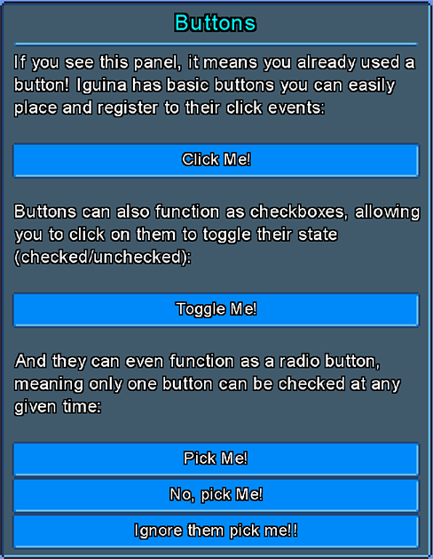

A clickable button.

Buttons inherit from `CheckedEntity`, which means you can make them toggleable and behave like a checkbox or a radio button, by enabling the `ToggleCheckOnClick` and `ExclusiveSelection` flags.

```cs
var button = panel.AddChild(new Button(uiSystem, "Click Me"));
button.Events.OnClick = (Entity entity) => { /* do something */ };
```

### `Paragraph`

The internal `Paragraph` entity used to render the button's text. Use it to change the text after creation:

```cs
button.Paragraph.Text = "New Text";
```

Default size: 100% width, 54 pixels height.

## Checkbox

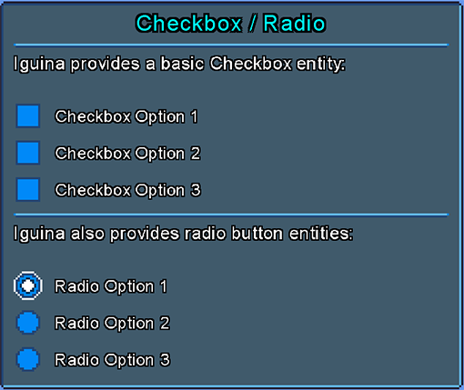

A toggleable checkbox, with a box indicating its state and a label.

`Checkbox` inherits from `CheckedEntity`, and has `ToggleCheckOnClick` enabled by default. Like buttons, its label is available via the `Paragraph` property.

```cs
var checkbox = panel.AddChild(new Checkbox(uiSystem, "Enable Sound"));
checkbox.Checked = true;
checkbox.Events.OnValueChanged = (Entity entity) => { SetSound(checkbox.Checked); };
```

## RadioButton

A toggleable radio button, with a box indicating its state and a label.
This entity is like a `Checkbox`, but it uses a different default stylesheet (falling back to the checkbox stylesheet if not set), and by default it has `ExclusiveSelection` = true and `CanClickToUncheck` = false.

Radio buttons are grouped by parent: only one radio button under the same parent can be checked at a time. To create multiple groups, put each group in its own panel.

`RadioButton` inherits from `CheckedEntity`, and its label is available via the `Paragraph` property.

## Paragraph

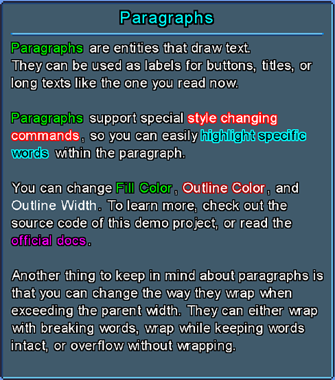

An entity used to render text.

`Paragraph` adds the following properties:

### `Text`

The string to render. Use `\n` for line breaks.

### `EnableStyleCommands`

If true (default), enables paragraph style commands.

Style commands are special codes you can put inside the text to change colors, outline and other properties mid-sentence.
A style command is written between `${}`, and a single `${}` block can contain multiple commands separated by commas. The following commands are supported:

* **FC:RRGGBBAA**: Change fill color. RRGGBBAA is the color components in hex. AA is optional.
* **OC:RRGGBBAA**: Change outline color. RRGGBBAA is the color components in hex. AA is optional.
* **OW:Width**: Change outline width, in pixels.
* **XO:Offset**: Set the X position, in pixels, of the next character. Useful for aligning text in columns.
* **ICO:Texture|sx|sy|sw|sh|scale|utc**: Embed an icon inside the text, with texture id, source rect (x, y, width, height), and optional scale. `utc` is an optional flag (`y` or `n`) that sets whether to tint the icon with the current text color.
* **RESET**: Reset all previously set style command properties.

For example, the following code:

```cs
paragraph.Text = "Hello, ${FC:00FF00}Hero${RESET}! Welcome to my ${OC:FF00FF,OW:2}cave${RESET}.";
```

Renders a `Paragraph` with the word 'Hero' in green, and the word 'cave' with a 2 pixel purple outline.

And this example embeds a 16x16 icon from `Textures/UI.png`, scaled by 2:

```cs
paragraph.Text = "You found ${ICO:Textures/UI.png|0|64|16|16|2} a gem!";
```

By default, invalid style commands throw an exception. You can set the static `Paragraph.ExceptionOnInvalidStyleCommands` to false to silently ignore them instead.

### `TextOverflowMode`

Determines how to handle text that overflows the parent entity's width:

- **Overflow**: text simply overflows the parent's width.
- **WrapWords** (default): text breaks into lines while keeping whole words intact.
- **WrapImmediate**: text breaks at the first character that overflows the parent's width.

### `ShrinkWidthToMinimalSize` / `ShrinkHeightToMinimalSize` / `ShrinkToMinimalSize`

If true (default), shrinks the `Paragraph` entity size to match the actual rendered text size. `ShrinkToMinimalSize` sets both.

### `MeasureText(text)` / `MeasureTextLineHeight()`

Measure the size, in pixels, of a string or of a single text line, using this paragraph's current style.

Note: paragraphs ignore interactions by default (they're click-through). If you want a paragraph to receive mouse events, pass `ignoreInteractions: false` to the constructor, or set `IgnoreInteractions = false`.

## Title

`Title` is a `Paragraph` that uses a different default stylesheet, intended for section or panel titles.

## Label

`Label` is a `Paragraph` that uses a different default stylesheet, intended for smaller texts, like the captions above input entities.

## Panel

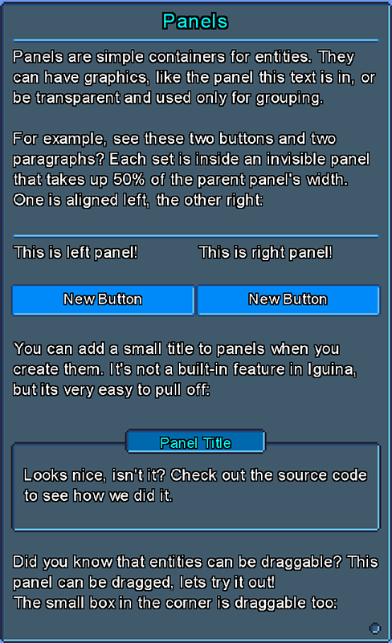

Panels are graphical containers of entities, like a window or a group box.
You can also create panels without graphics (by passing a null stylesheet) to group and lay out entities.

Default size: 400 x 400 pixels.

`Panel` adds the following properties and methods:

### `CreateVerticalScrollbar(autoSetScrollbarMax?)`

Add a vertical scrollbar to the panel. If `autoSetScrollbarMax` is true (default), the scrollbar's max value is set automatically, based on how far the lowest child entity extends below the panel's visible area.

When using scrollbars, you'll usually also want to set `OverflowMode = OverflowMode.HideOverflow` and turn off `AutoHeight`, so the content is cut at the panel edges:

```cs
var panel = new Panel(uiSystem);
panel.Size.SetPixels(500, 350);
panel.OverflowMode = OverflowMode.HideOverflow;
panel.CreateVerticalScrollbar();
```

### `VerticalScrollbar`

The panel's vertical scrollbar entity (a `Slider`), if one was created. Null if there is no scrollbar.

### `RemoveVerticalScrollbar()`

Remove the panel's vertical scrollbar.

### `InterpolateScrollbarOffset`

If true (default), the panel's scroll position animates smoothly when the scrollbar value changes. Set to false to jump immediately.

### `ScrollbarInterpolationSpeed`

How fast the scroll position animates when `InterpolateScrollbarOffset` is true. Default is `10`.

## HorizontalLine

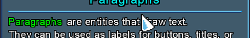

A graphical horizontal line to separate sections. It ignores interactions, and uses the `AutoCenter` anchor by default.

## VerticalLine

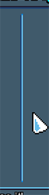

A graphical vertical line to separate sections. It ignores interactions, and uses the `AutoInlineLTR` anchor by default, so it can be placed between inline entities.

## RowsSpacer

An empty entity that adds vertical space between rows of entities. Its height is a multiple of the system stylesheet's `RowSpaceHeight` property:

```cs
panel.AddChild(new RowsSpacer(uiSystem));      // one row of space
panel.AddChild(new RowsSpacer(uiSystem, 3));   // three rows of space
```

## Slider

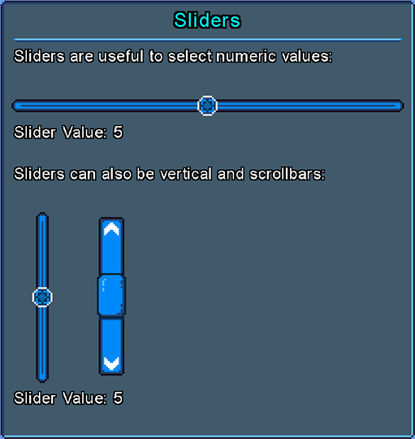

A slider to pick integer values, using a handle the user drags along a track.
It can be vertical or horizontal (set in the constructor).

```cs
var slider = panel.AddChild(new Slider(uiSystem, Orientation.Horizontal));
slider.MinValue = 0;
slider.MaxValue = 100;
slider.Value = 50;
slider.Events.OnValueChanged = (Entity entity) => { SetVolume(slider.Value); };
```

By default, sliders have a range of 0 to 10 and a starting value of 5.

`Slider` adds the following properties:

### `Handle`

The internal handle entity.

### `Orientation`

Slider orientation (vertical / horizontal). Read-only; set in the constructor.

### `MinValue` / `MaxValue`

Slider min and max values.

### `Value`

Slider current value. Setting a value outside the min / max range throws an exception.

### `ValueSafe`

Same as `Value`, but setting it never throws: the value is clamped to the min / max range.

### `ValueRange`

Value range (max - min).

### `ValuePercent`

The current value as a fraction, between 0.0 and 1.0.

### `StepsCount`

How many steps the slider has. 0 (default) means one step per value (`MaxValue - MinValue`). Can't be bigger than `ValueRange`.

### `AutoSetRange`

If true, the slider sets its range (min, max and steps count) automatically based on its size in pixels.

### `FlippedDirection`

If true, flips the slider direction.

### `MouseWheelStep`

How much to change the slider value when the mouse wheel scrolls over it.

### `KeyboardStep`

How much to change the slider value when the user interacts with it via keyboard (arrow keys on a focused slider).

## ProgressBar

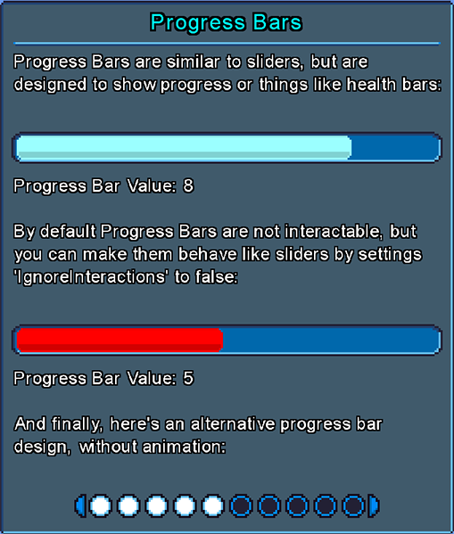

`ProgressBar` is a `Slider`, but instead of dragging a handle, it 'fills' an internal entity based on its value. The fill entity is the slider's `Handle`, which uses the `...ProgressBarsFill` stylesheets.

Progress bars ignore user interactions by default. Set `IgnoreInteractions = false` if you want the user to be able to change their value, like a slider.

```cs
var healthBar = panel.AddChild(new ProgressBar(uiSystem));
healthBar.MaxValue = 100;
healthBar.Value = 75;
healthBar.Handle.OverrideStyles.TintColor = new Color(255, 0, 0, 255);
```

## ColorSlider

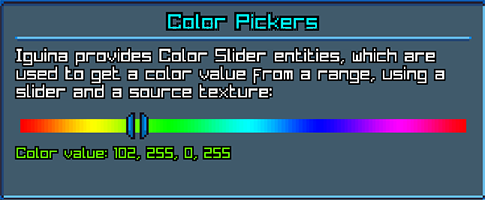

`ColorSlider` is a `Slider` used to pick a color from a range.
The color is taken from the source texture and source rectangle used to render the slider itself (its stylesheet's `FillTextureStretched`).

With color sliders you don't need to set the min, max, or steps count properties. They are set automatically.

`ColorSlider` implements [`IColorPicker`](#icolorpicker).

### `ColorValue`

Get / set the color value, as extracted from the source texture. When set, the handle moves to the position of this color.

### `SetColorValueApproximate(color)`

Set the value to the nearest color available in the slider.

## ColorPicker

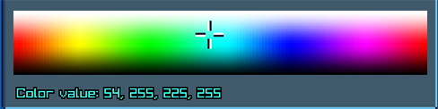

`ColorPicker` is used to pick a color from a 2D texture, by dragging a handle over it.
The default UI theme comes with a texture that covers all basic colors, creating a color picker similar to painting software. However, you can replace it with a palette of your choice.

A color picker must have a stretched texture (`FillTextureStretched`) in its stylesheet, which is used as its source texture.

`ColorPicker` implements [`IColorPicker`](#icolorpicker).

### `ColorValue`

Get / set the color value, as extracted from the source texture.

### `SetColorValueApproximate(color)`

Set the value to the nearest color available in the source texture.

### `Handle`

The internal handle entity.

### `SetHandleOffset(offset)`

Set the handle offset, in pixels, from the top-left corner of the entity.

### `SetHandleOffsetFromSource(offset)`

Set the handle offset, where the offset is a pixel position in the source texture, relative to the source rectangle's top-left corner.

## ColorButtons

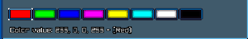

`ColorButtons` is used to pick a color from a set of predefined colors, using simple buttons.
Unlike the other color pickers, the choices are not defined by the stylesheet; you add them by code.

```cs
var colors = panel.AddChild(new ColorButtons(uiSystem));
colors.AddColor(new Color(255, 0, 0, 255), "Red");
colors.AddColor(new Color(0, 255, 0, 255), "Green");
colors.AddColor(new Color(0, 0, 255, 255), "Blue");
colors.Events.OnValueChanged = (Entity entity) => { SetTeamColor(colors.ColorValue); };
```

`ColorButtons` implements [`IColorPicker`](#icolorpicker).

### `AddColor(color, label?)`

Add a color choice. A button tinted with `color` is added, with an optional text `label`.

### `ColorValue`

Get / set the selected color. Setting a color that is not in the list throws an exception; use `SetColorValueApproximate()` to snap to the nearest color instead.

### `ColorIndex`

Get / set the index of the selected color button.

### `ColorLabel`

Read-only. The label text of the currently selected color button.

## IColorPicker

`IColorPicker` is a shared interface implemented by `ColorSlider`, `ColorPicker`, and `ColorButtons`. It exposes:

- **`ColorValue`**: get / set the selected color exactly.
- **`SetColorValueApproximate(color)`**: set the value to the closest available color in the picker (useful when an exact match is not guaranteed).

## ListBox

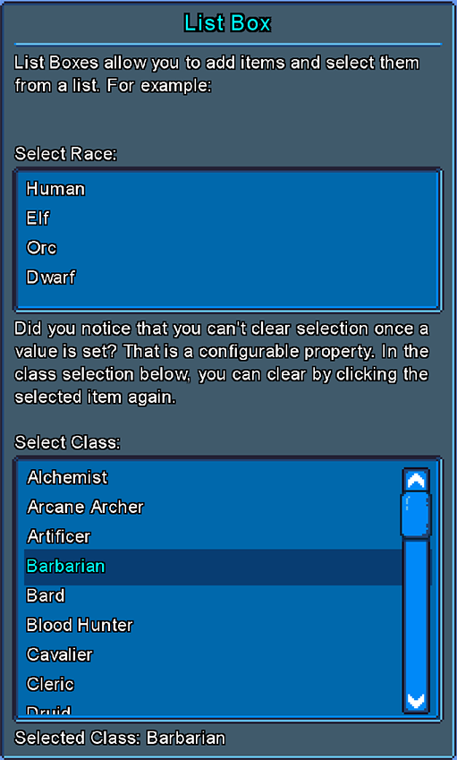

A list of string items the user can select from. Every item has a value, and an optional label to display instead of the value.

```cs
var list = panel.AddChild(new ListBox(uiSystem));
list.AddItem("warrior", "Warrior");
list.AddItem("mage", "Mage");
list.AddItem("rogue", "Rogue");
list.SelectedValue = "mage";
list.Events.OnValueChanged = (Entity entity) => { SelectClass(list.SelectedValue); };
```

A `ListBox` is a `Panel`, and it shows a scrollbar automatically when it has more items than it can show. Focused lists can also be navigated with the keyboard (up / down).

Default size: 100% width, 400 pixels height.

`ListBox` adds the following properties and methods:

### `AddItem(value, label?, index?)`

Add an item to the list. `label` is the text to display (falls back to `value` if not set). `index` inserts the item at a specific position instead of appending it.

### `ReplaceItem(index, value, label?)` / `ReplaceItem(valueToReplace, value, label?)`

Replace an existing item, by index or by value. If the replaced item was selected, the selection is updated to the new value.

### `RemoveItem(value)` / `RemoveItem(index)`

Remove an item by index, or all the items with the given value.

### `Clear()`

Remove all items from the list.

### `ItemsCount`

How many items are in the list.

### `SelectedIndex`

Get / set the selected index. -1 means no item is selected.

### `SelectedValue`

Get / set the selected item value, or null if no item is selected.

### `SelectedText`

The selected item's label text (without any embedded icon commands), or its value if no label is set.
Null if no item is selected.

### `SelectedTextWithIcon`

Like `SelectedText`, but includes embedded icon style commands if the item's label contains them.
Null if no item is selected.

### `AllowDeselect`

If true (default), the user can click on the selected item again to deselect it.

### `SetItemLabel(value, label)` / `SetItemLabel(value, label, icon, iconUseTextColor)` / `SetItemLabel(value, icon, iconUseTextColor)`

Change the displayed label of an existing item without changing its value. The icon overloads add an inline icon at the beginning of the label (using paragraph style commands).

```cs
list.SetItemLabel("warrior", new IconTexture() { TextureId = "Textures/Icons.png", SourceRect = new Rectangle(0, 0, 32, 32) }, true);
```

### `GetIndexOfValue(value)`

Returns the index of the item with the given value, or -1 if not found.

### `SetVisibleItemsCount(count)`

Set the list's height so it shows exactly this number of items.

### `ScrollToSelected()`

Move the scrollbar so the selected item is visible.

### `DisplayFilter`

An optional `Func<ListItem, bool>` callback. When set, only items for which it returns `true` are displayed. Hidden items remain in the list, and can still be selected by code. Useful for search boxes.

### `OverrideItemStyles`

A `StyleSheetState` that overrides the stylesheet for every non-selected item.

### `OverrideSelectedItemStyles`

A `StyleSheetState` that overrides the stylesheet for the selected item.

### `OverrideItemStyleByValue`

A `Dictionary<string, StyleSheetState>` of per-value style overrides. Lets you apply a custom style to specific items, identified by their value.

```cs
list.OverrideItemStyleByValue["mage"] = new StyleSheetState() { TextFillColor = new Color(0, 128, 255, 255) };
```

### `ItemsStyleSheet`

The stylesheet used for the list items.

## DropDown

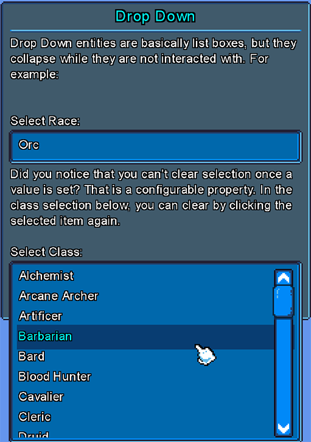

`DropDown` is a `ListBox` that collapses into a single line showing the selected value, and opens when clicked.
It's a compact alternative to a full list box. By default it uses `AutoHeight`.

`DropDown` adds the following properties and methods on top of `ListBox`:

### `IsOpened`

Read-only. `true` when the dropdown list is currently open.

### `OpenList()` / `CloseList()` / `ToggleList()`

Open, close, or toggle the dropdown list by code.

### `DefaultSelectedText`

Text to show in the collapsed state when no item is selected. If null and nothing is selected, the collapsed line is empty.

### `OverrideSelectedText`

When set, this string is always shown in the collapsed state, regardless of the selected item or `DefaultSelectedText`.

### `OverrideClosedStateTextStyles`

A `StyleSheetState` that overrides the style of the text shown in the collapsed state.

### `ShowArrowIcon(show)`

Show or hide the arrow icon that indicates the dropdown's open / closed state. The icon is only created if the `DropDownIcon` stylesheet is set.

### `GetClosedStateHeight(includePadding?, includeExtraSize?)`

Returns the height, in pixels, of the dropdown in its collapsed state.

### `SetVisibleItemsCount(count)`

For dropdowns, this sets how many items are visible while the list is open.

## TextInput

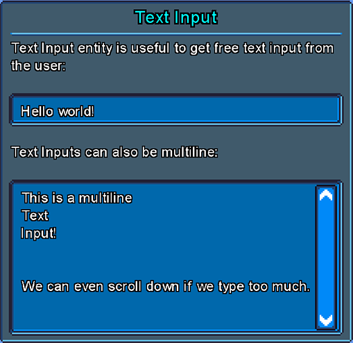

An entity to get free text input from users. It supports caret movement and all the typing commands provided by the input provider.

```cs
var nameInput = panel.AddChild(new TextInput(uiSystem));
nameInput.PlaceholderText = "Enter your name";
nameInput.MaxLength = 16;
nameInput.Events.OnValueChanged = (Entity entity) => { playerName = nameInput.Value; };
```

`TextInput` is a `Panel`. For multiline text inputs, you can add a scrollbar with `CreateVerticalScrollbar()`.

Default size: 100% width, 40 pixels height.

`TextInput` adds the following properties:

### `Value`

The current text value.

### `PlaceholderText`

Optional text to show when the text input is empty. Rendered with the `NoValueTextFillColor` style property.

### `Multiline`

If true, the text input supports line breaks.

### `MaxLines`

Optional lines limit, when `Multiline` is true.

### `MaxLength`

Optional max length, in characters.

### `MaskingCharacter`

If set, every character is displayed as this character.
Useful for password input fields, where you want the password hidden.

### `CaretOffset`

The caret position, in characters from the beginning of the text.

### `CaretCharacter`

The string used to display the caret. Default is `|`.

### `CaretBlinkingSpeed`

The caret blinking speed. Default is `3`.

### `InsertCharacters(text)` / `InsertCharacter(character)`

Insert text at the caret position, as if it was typed by the user.

## NumericInput

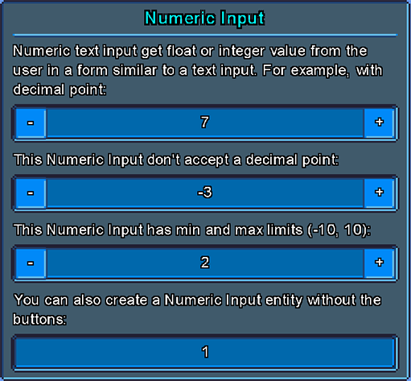

`NumericInput` is a `TextInput` that only accepts numbers, and optionally has minus (-) and plus (+) buttons to decrease or increase the value. Use the constructor's `addPlusButton` and `addMinusButton` parameters to create it without them.

```cs
var amount = panel.AddChild(new NumericInput(uiSystem));
amount.MinValue = 1;
amount.MaxValue = 99;
amount.AcceptsDecimal = false;
amount.NumericValue = 1;
```

`NumericInput` adds the following properties:

### `NumericValue`

Get / set the current value as a `decimal`. Setting it throws if the value is outside `MinValue` / `MaxValue`, or if it has a fraction and `AcceptsDecimal` is false.

### `DefaultValue`

The value `NumericValue` returns when the text field is empty or invalid. Default is `0`.

### `AcceptsDecimal`

If true (default), the field accepts a decimal point and fractional values. If false, only integers are allowed.

### `MinValue` / `MaxValue`

Optional min and max values. Values typed by the user, or set with the buttons, are clamped to this range.

### `ButtonsStepSize`

How much to increase or decrease the value when the user clicks the + or - buttons. Default is `1`.

### `MinusButtonText` / `PlusButtonText`

Get / set the text on the minus and plus buttons.

### `CultureInfo`

The `CultureInfo` used for parsing and formatting numbers. It determines the decimal separator and negative sign characters.

### `DecimalSeparator` / `NegativeSign`

Read-only. The characters used as the decimal point and negative sign, derived from `CultureInfo`.

# MessageBoxUtils

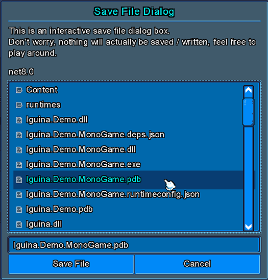

A utility to show message boxes and file dialogs. Access it via `uiSystem.MessageBoxes`.

Every method returns a `MessageBoxHandle`, which contains the created entities (`MessageBoxPanel`, `ContentContainer`, `Buttons` and `Backdrop`, which is null if the message box has no backdrop), and a `Close()` method to close the message box by code.

All methods accept an optional `MessageBoxOptions` parameter, with the following fields:

* **AutoHeight**: if true, the message box height adjusts to its content.
* **Size**: the message box size, in pixels.
* **Draggable**: if true, the user can drag the message box around.
* **AddBackdrop**: if true, adds a backdrop entity that covers the screen behind the message box and blocks interactions with the rest of the UI. It uses the `MessageBoxBackdrop` stylesheet.

If not provided, `MessageBoxes.DefaultOptions` is used (auto height, 700 x 600 pixels, draggable, with backdrop).

## `ShowInfoMessageBox(title, text, onConfirm?, buttonText?, options?)`

Show an info message box with text and a single OK button.

```cs
uiSystem.MessageBoxes.ShowInfoMessageBox("Game Saved", "Your progress was saved successfully.");
```

## `ShowConfirmMessageBox(title, text, onConfirm?, onCancel?, confirmText?, cancelText?, options?)`

Show a prompt with Confirm and Cancel buttons.

```cs
uiSystem.MessageBoxes.ShowConfirmMessageBox("Quit Game", "Are you sure you want to quit?",
    onConfirm: () => Exit(),
    confirmText: "Quit");
```

## `ShowMessageBox(title, text, buttons, options?)`

Show a message box with your own set of buttons. Each button is a `MessageBoxUtils.MessageBoxButtons`, with a text and an action to run when clicked:

* `new MessageBoxButtons(text, Action action, closeMessageBox = true)`: runs the action, then closes the message box (if `closeMessageBox` is true).
* `new MessageBoxButtons(text, Func<bool> action, closeMessageBox = true)`: runs the action, and only closes the message box if it returns `true`.

```cs
uiSystem.MessageBoxes.ShowMessageBox("Unsaved Changes", "Do you want to save your changes before quitting?", new MessageBoxUtils.MessageBoxButtons[]
{
    new MessageBoxUtils.MessageBoxButtons("Save", () => { SaveAndQuit(); }),
    new MessageBoxUtils.MessageBoxButtons("Don't Save", () => { Quit(); }),
    new MessageBoxUtils.MessageBoxButtons("Cancel", () => { }),
});
```

Note: since the two constructors differ only by the action type, pass a lambda (like `() => { }`) rather than `null`, otherwise the call is ambiguous.

## `ShowSaveFileDialog(title, text, onConfirm?, onCancel?, startingFolder?, filesFilter?, fileDialogOptions?, confirmText?, cancelText?, rootLabel?, options?)`

Show a save file dialog, that lets the user browse folders and pick an existing file name or type a new one.

`onConfirm` receives the selected file's full path, and returns `true` to close the dialog, or `false` to keep it open (for example, if you want to reject the selected file).

```cs
uiSystem.MessageBoxes.ShowSaveFileDialog("Save Level", "Select where to save the level:",
    onConfirm: (string path) => { SaveLevel(path); return true; },
    startingFolder: "Levels",
    filesFilter: (string file) => file.EndsWith(".lvl"));
```

## `ShowOpenFileDialog(...)`

Show an open file dialog. It takes the same parameters as `ShowSaveFileDialog()`, but has different default flags and is designed to select an existing file, rather than create a new file or overwrite an existing one.

## File Dialog Options

The `fileDialogOptions` parameter is a combination of the following `MessageBoxUtils.FileDialogOptions` flags:

* **AllowGoingUpFolders**: allow the user to go up one folder.
* **AllowEscapingRootFolder**: allow the user to leave the starting folder.
* **FileMustExist**: the selected file must exist.
* **FileMustNotExist**: the selected file must not exist.
* **ShowFolders**: show folders in the dialog.
* **ShowFiles**: show files in the dialog.
* **ShowFullPath**: always show the current full path above the files list.

The defaults are `MessageBoxUtils.DefaultSaveFileOptions` and `MessageBoxUtils.DefaultOpenFileOptions` (which adds `FileMustExist`).

File dialogs use the `file` and `folder` icons from the system stylesheet's `SystemIcons`, if defined.

# How To...

Here are some common tasks and how to do them with `Iguina`. You can find more examples in the [demo project](Iguina.Demo/IguinaDemoStarter.cs).

## Place entities side by side

Give each entity a percentage width, and use the `AutoInlineLTR` anchor:

```cs
for (int i = 0; i < 2; ++i)
{
    var column = new Panel(uiSystem);
    column.Size.X.SetPercents(50f);
    column.Size.Y.SetPixels(140);
    column.Anchor = Anchor.AutoInlineLTR;
    parent.AddChild(column);

    column.AddChild(new Label(uiSystem, $"Column {i + 1}"));
    column.AddChild(new Button(uiSystem, "Click Me"));
}
```

To group entities without any graphics, create the panels with a null stylesheet: `new Panel(uiSystem, null!)`.

## Create a window with a title

```cs
var window = new Panel(uiSystem);
window.Size.SetPixels(500, 1);
window.AutoHeight = true;
window.Anchor = Anchor.Center;
window.DraggableMode = DraggableMode.DraggableConfinedToScreen;
uiSystem.Root.AddChild(window);

window.AddChild(new Title(uiSystem, "Settings") { Anchor = Anchor.AutoCenter });
window.AddChild(new HorizontalLine(uiSystem));
window.AddChild(new Paragraph(uiSystem, "Adjust your settings below."));
```

## Create a group of toggle buttons

```cs
foreach (var tab in new[] { "Inventory", "Skills", "Map" })
{
    var button = tabsPanel.AddChild(new Button(uiSystem, tab));
    button.ToggleCheckOnClick = true;
    button.ExclusiveSelection = true;
    button.CanClickToUncheck = false;
    button.Events.OnChecked = (Entity entity) => { ShowTab(tab); };
}
```

## Show and hide screens

Create a panel per screen and toggle its `Visible` property. Hidden entities don't render, don't receive input, and don't take up space in auto layouts.

```cs
mainMenu.Visible = false;
optionsMenu.Visible = true;
```

## Disable or lock parts of the UI

Set `Enabled = false` to disable an entity and all its children (rendered with the `Disabled` style), or `Locked = true` to block interactions while rendering normally.

## Style a single entity

Use `OverrideStyles` to change style properties of a specific entity, without affecting other entities that share its stylesheet:

```cs
warningText.OverrideStyles.TextFillColor = new Color(255, 200, 0, 255);
```

Or give it a different stylesheet in its constructor.

## Respond to events from all entities

Use `uiSystem.Events` instead of `entity.Events`. For example, to play a sound whenever any entity is clicked:

```cs
uiSystem.Events.OnClick = (Entity entity) => { if (entity is Button) PlayClickSound(); };
```

## Find entities

Use `Walk()` with the `Identifier` property:

```cs
Entity? found = null;
uiSystem.Root.Walk((Entity entity) =>
{
    if (entity.Identifier == "PlayButton") { found = entity; return false; }
    return true;
});
```

## Animate entities

State transitions are animated by the stylesheet's `InterpolateStatesSpeed` and `InterpolateOffsetsSpeed` properties. For custom animations, you can change entity properties every frame in the `BeforeUpdate` / `AfterUpdate` events, use `ColorAnimator` for color effects, or use an external tweening library (the demo project uses [Morpheus](https://github.com/RonenNess/Morpheus)).

# Tips & Gotchas

* **Auto anchors follow the previous sibling.** Auto-anchored entities are positioned relative to the previous visible sibling, whatever its anchor is. Add constant-anchored entities after auto-anchored ones, or put them in their own container.
* **Percent sizes are relative to the parent's internal size.** Padding is subtracted, so two entities of 50% width fit exactly in one row.
* **`Value` vs `ValueSafe`.** Setting a slider's `Value` outside its range throws an exception. Use `ValueSafe` to clamp instead. Similarly, `NumericInput.NumericValue` throws on out-of-range values.
* **Radio buttons are grouped by parent.** Only siblings are mutually exclusive, so put separate groups in separate panels.
* **Paragraphs are click-through by default.** Pass `ignoreInteractions: false` to their constructor if you want them to receive mouse events.
* **Change a button's text via its `Paragraph`.** Use `button.Paragraph.Text`, not a new button.
* **Changing default stylesheets doesn't affect existing entities.** Set `uiSystem.DefaultStylesheets` before creating your entities.
* **Don't touch the UI from other threads.** Use `InvokeOnUIThread()`.
* **Debug your layout** with `uiSystem.DebugRenderEntities = true`.

# Misc

## Using with Android & MonoGame

To use `Iguina` on Android with MonoGame, you can find general instructions [here](https://github.com/RonenNess/Iguina/issues/11).

# Changelist

## 1.0.1

- Added `SelectedText` property to `ListBox` and `DropDown`.
- Fixed `DropDown` to properly show the selected item label (if set) and not just the item value.
- Adjusted `ListBox` and `DropDown` to change selection value if the selected item value is replaced.
- Added `OverrideSelectedText` property to `DropDown`.

## 1.0.2

- Added `Label` entity.
- Added the ability to override styles for items and selected items in `ListBox` and `DropDown`.
- Set `DropDown` to `Auto Height` by default.
- Refactored `DropDown` to always show selected value and look more like a 'classic' dropdown.
- Added `BoxOutlineWidth`, `BoxOutlineOffset` and `BoxOutlineColor` property to entities.
- Made Paragraphs ignore user interactions by default.
- Made `DropDown` collision rectangle slightly larger to make it more convenient.
- Added `SetVisibleItemsCount()` method to `ListBox` and `DropDown`.
- Added methods to `DropDown` to open, close and toggle list.

## 1.0.3

- Made `HorizontalLine` ignore interactions by default.
- Added entity to create empty spaces between rows.
- Fixed auto sizes to take `MarginAfter` property into calculation.
- Improved debug drawing entities.
- Updated demo project.

## 1.0.4

- Added utility to generate message boxes.
- Added `BackgroundColor` stylesheet property.
- Renamed `FillColor` stylesheet property.
- Updated stylesheet.

## 1.0.5

- Added `NumericInput` entity.
- Added index property when adding child.
- Small improvements to Message Boxes.
- Added `MaskingCharacter` to `TextInput`.
- Added small extra margin to scissor region to make sure text outline don't get cut off.
- Made `TextInput` less "sticky" to be kept focused.

## 1.0.6

- Added stylesheet inheritance and changed default theme to utilize it.
- Added `VerticalLine` entity.
- Added global text scale factor.
- Added global cursor scale factor.
- Added TextScale stylesheet property.
- Added option to set Minus / Plus buttons text in a Numeric Input.
- Made Minus / Plus buttons in Numeric Input use the `MarginBefore` and `MarginAfter` properties for positioning.
- Improved the way we render framed textures.
- Added arrow icon to `DropDown` entities.
- Added the ability to embed icons inside texts using style commands.

## 1.0.8

- Upgraded .net version to `8.0`.

## 1.0.9

- Fixed Paragraph icons to use text scale global factor.
- Added another fallback to Paragraph stylesheet for ListBox items, just in case a user accidentally provided null in the constructor.
- Added method to set ListBox label with icon.
- Added methods to push entity to back or front.
- Made it safe to add / remove entities while iterating them, to prevent exceptions if changing entities tree from events.
- Made entities bring themselves to front when they are being dragged.

## 1.0.10

- Added `ColorSlider` entity.
- Added `ColorPicker` entity.

## 1.0.11

- Fixed bug with list / dropdown label icons with `MonoGame` renderer.

## 1.0.12

- Improved the way `ColorPicker` and `ColorSlider` works internally, now its possible to set their starting value without waiting for an update first.
- Added the ability to set `ColorSlider` and `ColorPicker` values from a given color.
- Added the `IColorPicker` interface.

## 1.0.13

- Fixed a bug with `NumericInput` having wrong value during the `OnChange` event call.
- Fixed a bug with `NumericInput` not being able to accept values that start with '0.'.
- General improvements to `NumericInput` input normalization.
- Added identifiers to message box generated entities.
- Fixed issue that some panels flicker when they appear for the first time for a single frame.
- Added some unit tests.

## 1.0.14

- Added `MeasureVector.FromPixels` and `MeasureVector.FromPercents` methods.
- Added demo example with external animations (Morpheus).
- Added `ShowInfoMessageBox` to message box utility.

## 1.1.0

**Breaking Changes**

- Renamed 'Focus' related properties.
- Changed default built-in theme.
- Added method to implement in input provider.
- Changed the value returned from lists `SelectedText`.
- Added 'focused entity' behavior for systems (can be disabled).

All changes:

- Added `InvokeOnUIThread` to handle concurrency properly.
- Added focused entities mechanism.
- Added `Focused` entity style.
- Added single-thread validations in debug mode.
- Added system-level UI icons.
- Added open files dialog boxes.
- Made list paragraphs propagate mouse events to parent list, so list mouse events can be properly used.
- Added basic keyboard interactions with focused entity.
- Added method to set list scrollbar offset to selected item.
- Added `SelectedTextWithIcon` to `ListBox` and changed `SelectedText` to not include icons data.
- Added `Offset`, `CenterVertically` and `CenterHorizontally` properties to icons.
- Made built-in UI theme more compact and clean.
- Updated dependencies.

## 1.1.1

- Added option to make base entities interactable.
- Added option to override cursor properties.
- Added paragraph style command to change text offset (useful to align labels).
- Added method `ClearChildren()`.
- Added `InteractableTargetedEntity` to get `TargetedEntity`, but only if its interactable.

## 1.1.2

- Added display filter to lists and dropdown.
- Made per-item stylesheet public for list box and dropdown.
- Added 'DefaultTexture' and 'TextureScale' properties to system stylesheet, to reduce duplications in stylesheets.
- Updated the built-in theme to make it leaner and with less duplications.

## 1.1.3

- Added `AutoWidthMaxSize` and `AutoHeightMaxSize` to limit auto size values.
- Added files reader provider to allow users to change the source of content files.
- Fixed message boxes back drop fade-in bug (+ added proper fade in support).
- Fixed corners scale bug with panels that have texture scale.
- Added `FrameWidth` graphic property to `FillTextureFramed` as a simpler way to set `InternalSourceRect` out of `ExternalSourceRect`.

## 1.1.4

- Upgraded .net version to `9.0`.
- Updated libraries for demo projects and tests.
- Added icon to projects.
- Added `ColorButtons` entity.
- Added comparison operators and hash to `Color` struct.
- Added style property `BackgroundColorPadding`.

## 1.1.5

- Upgraded .net version to `10.0`.
- Updated libraries for demo projects and tests.

## 1.1.6

- Fixed bug with scrollbars wrong max value (max value never shrinking back, and scrollbars not disabling when content fits).
- Fixed `CreateVerticalScrollbar(bool)` ignoring its `autoSetScrollbarMax` parameter.
- Fixed stylesheet inheritance (`InheritFrom`) not inheriting the `Focused` state.
- Fixed `MessageBoxHandle.Close()` throwing an exception for message boxes without a backdrop. `MessageBoxHandle.Backdrop` is now nullable.
- Made `MessageBoxUtils.ShowMessageBox()` public, to allow message boxes with custom buttons.
- Fixed `CursorProperties.SourceRect` documentation.
- Added unit tests for message boxes and stylesheet inheritance.
- Updated and extended the readme file.
- Updated libraries.

# License

`Iguina` is distributed under the permissive MIT license.
You can use it for any purpose.

The UI theme in the demo project was made by me, and it's public domain.
